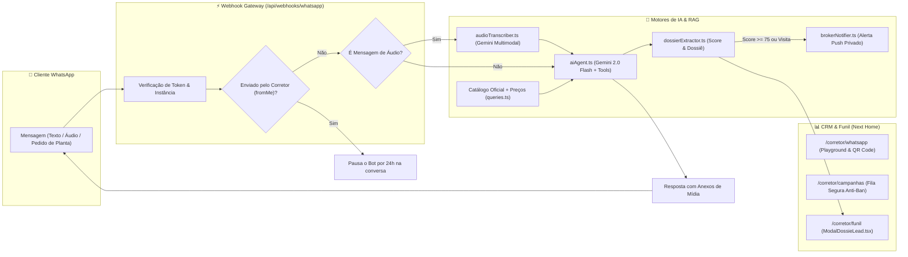

# 🕵️ Guia de Verificação e Auditoria Técnica — Sistema Multi-WhatsApp IA
> **Destinatário:** Claude (ou Auditor Técnico Sênior)  
> **Repositório:** Next Home Imobiliária  
> **Escopo:** Sistema Multi-Tenant de WhatsApp por Corretor, Agente IA Conversacional (Gemini 2.0 Flash + RAG), Fila Anti-Ban de Campanhas, Transcrição de Áudio e Dossiê no CRM.

---

## 🎯 1. Resumo Executivo da Arquitetura

O sistema transforma o atendimento e a reativação da Next Home em uma operação inteligente, automatizada e segura:



---

## 📂 2. Mapa dos Arquivos Implementados

Por favor, inspecione e revise os seguintes arquivos no repositório:

| Camada | Arquivo | Responsabilidade Principal |
|---|---|---|
| **Banco de Dados** | [`supabase/migrations/0018_whatsapp_multi_instancias.sql`](../supabase/migrations/0018_whatsapp_multi_instancias.sql) | Schema com RLS: `corretor_whatsapp_instancias`, `whatsapp_conversas`, `whatsapp_mensagens`, `whatsapp_campanhas`, `whatsapp_campanhas_fila`, `lead_observacoes_ia`. |
| **Tipagem** | [`src/lib/whatsapp/types.ts`](../src/lib/whatsapp/types.ts) | Interfaces TypeScript completas para o ecossistema de WhatsApp. |
| **Tipagem Supabase** | [`src/lib/supabase/types.ts`](../src/lib/supabase/types.ts) | Definição das novas tabelas no schema do Supabase. |
| **Agente IA & RAG** | [`src/lib/whatsapp/aiAgent.ts`](../src/lib/whatsapp/aiAgent.ts) | Prompt de sistema com catálogo de Alphaville, detecção de intenção, geração de respostas e anexos de fotos/plantas. |
| **Extrator de Dossiê** | [`src/lib/whatsapp/dossierExtractor.ts`](../src/lib/whatsapp/dossierExtractor.ts) | Extração de orçamento, perfil familiar, urgência, objeções e score (0-100). |
| **Processador de Áudio**| [`src/lib/whatsapp/audioTranscriber.ts`](../src/lib/whatsapp/audioTranscriber.ts) | Transcrição e extração de intenções de áudios via Gemini 2.0 Flash Multimodal. |
| **Alertas ao Corretor** | [`src/lib/whatsapp/brokerNotifier.ts`](../src/lib/whatsapp/brokerNotifier.ts) | Alertas push no WhatsApp privado do corretor para leads quentes e agendamento de visitas. |
| **Fila Anti-Ban** | [`src/lib/whatsapp/campaignQueue.ts`](../src/lib/whatsapp/campaignQueue.ts) | Agendador de disparos com atraso dinâmico de 30-75s e hiper-personalização de texto. |
| **Webhook Gateway** | [`src/app/api/webhooks/whatsapp/route.ts`](../src/app/api/webhooks/whatsapp/route.ts) | Rota central `GET` (challenge Meta) e `POST` (recebimento multi-provedor). |
| **Painel do Corretor** | [`src/app/corretor/(painel)/whatsapp/WhatsappManager.tsx`](../src/app/corretor/%28painel%29/whatsapp/WhatsappManager.tsx) | Gerador de QR Code, seletores de modo do bot e Playground de Live Chat interativo. |
| **Campanhas** | [`src/app/corretor/(painel)/campanhas/CampanhasManager.tsx`](../src/app/corretor/%28painel%29/campanhas/CampanhasManager.tsx) | Criador de disparos em lote com filtros do CRM e preview de variações da IA. |
| **Dossiê no Funil** | [`src/app/corretor/(painel)/funil/ModalDossieLead.tsx`](../src/app/corretor/%28painel%29/funil/ModalDossieLead.tsx) | Modal com abas de Dossiê Executivo, Live Chat e controle de pausa da IA. |
| **Integração no Quadro**| [`src/app/corretor/(painel)/funil/Quadro.tsx`](../src/app/corretor/%28painel%29/funil/Quadro.tsx) | Botão `🤖 Dossiê IA` em cada card do funil de vendas. |
| **Testes Vitest** | [`src/lib/whatsapp/whatsapp.test.ts`](../src/lib/whatsapp/whatsapp.test.ts) | Suíte automatizada com 5 testes cobrindo todas as funções críticas. |

---

## 🔍 3. Checklist de Auditoria para o Claude

Ao analisar a implementação, favor auditar os seguintes pontos críticos:

### A. Protocolo Anti-Ban e Segurança
- [ ] O espaçamento dinâmico entre mensagens na fila ([`campaignQueue.ts`](../src/lib/whatsapp/campaignQueue.ts)) respeita o intervalo humanizado de **30 a 75 segundos**?
- [ ] A reescrita de mensagens por IA garante que nenhuma mensagem de campanha saia com texto idêntico?
- [ ] Se o corretor responder manualmente pelo app do celular (`fromMe: true`), a IA pausa o atendimento naquela conversa para evitar respostas conflitantes?

### B. Motor de IA e RAG
- [ ] O prompt do sistema em [`aiAgent.ts`](../src/lib/whatsapp/aiAgent.ts) injeta os imóveis reais do catálogo com preços formatados e URLs de fotos/plantas?
- [ ] O extrator de dossiê ([`dossierExtractor.ts`](../src/lib/whatsapp/dossierExtractor.ts)) possui fallbacks resilientes caso a API Key esteja ausente ou o Gemini demore a responder?
- [ ] O processador de áudio ([`audioTranscriber.ts`](../src/lib/whatsapp/audioTranscriber.ts)) aceita tanto URLs diretas quanto buffers Base64 inline?

### C. Experiência do Corretor (UI/UX)
- [ ] O Playground em [`WhatsappManager.tsx`](../src/app/corretor/%28painel%29/whatsapp/WhatsappManager.tsx) permite ao corretor testar a assistente com feedback instantâneo de digitação e extração de dossiê?
- [ ] O modal de lead ([`ModalDossieLead.tsx`](../src/app/corretor/%28painel%29/funil/ModalDossieLead.tsx)) permite alternar facilmente entre o Dossiê e o Live Chat com link direto para o WhatsApp do cliente?

### D. Integridade do Banco de Dados e RLS
- [ ] A migration [`0018_whatsapp_multi_instancias.sql`](../supabase/migrations/0018_whatsapp_multi_instancias.sql) protege as instâncias e conversas com políticas RLS para que um corretor não leia dados de outro corretor?

---

## ⚙️ 4. Comandos de Verificação Rápida

Para verificar a integridade da suíte no terminal:

```bash
# 1. Executar os testes automatizados (61 testes em 9 arquivos)
npm test

# 2. Validar estritamente a compilação TypeScript (0 erros esperados)
npx tsc --noEmit

# 3. Testar a rota de Webhook com payload de simulação
powershell -Command "Invoke-RestMethod -Uri 'http://localhost:3000/api/webhooks/whatsapp' -Method Post -Body (@{sender='5511999998888'; text='Ola, procuro 3 suites em Alphaville'} | ConvertTo-Json) -ContentType 'application/json'"
```

---

## 📌 5. Conclusão da Validação

Se todos os itens do checklist acima estiverem em conformidade, o sistema está **pronto para homologação e deploy em produção**.
