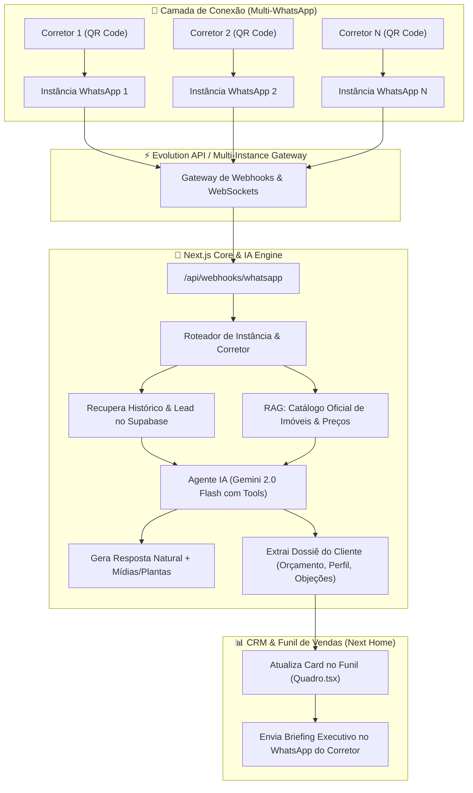
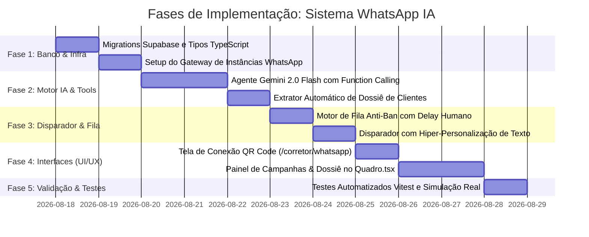

# 📱 Roadmap Completo: Sistema Multi-WhatsApp com Agente IA, Disparo Seguro & Dossiê de Clientes
> **Next Home Imobiliária** — Especificação Técnica de Ponta a Ponta para Atendimento Receptivo, Reativação Ativa de Base e Inteligência Comercial.

---

## 🎯 1. Visão Geral & Objetivos

Transformar o WhatsApp da Next Home na **principal máquina de vendas e qualificação da imobiliária**, operando com segurança total, alta tecnologia e zero fricção para a equipe de corretores.

### Os 3 Pilares do Sistema:
1. **Multi-Tenant WhatsApp (1 Número por Corretor):** Cada corretor conecta o seu próprio WhatsApp via QR Code no painel da Next Home, mantendo sua identidade e carteira.
2. **Agente IA com Contexto do Banco de Dados (Gemini 2.0 Flash + RAG):** A IA atende os clientes conhecendo a tabela de preços atualizada, plantas, metragens, fotos e disponibilidade de Alphaville.
3. **Disparador Ativo Seguro (Smart Broadcast Anti-Ban):** Fila de reativação com delays humanos (25s a 75s) e hiper-personalização de mensagens para leads da base.
4. **Dossiê Executivo Automático de Inteligência:** A IA analisa a conversa e preenche automaticamente o perfil, orçamento, urgência, objeções e temperatura do lead no CRM (`Quadro.tsx`).

---

## 🏗️ 2. Arquitetura Geral do Sistema



---

## 🗄️ 3. Estrutura do Banco de Dados (Supabase Migration)

### 1. Tabela: `corretor_whatsapp_instancias`
Gerencia a conexão e regras de cada corretor:
```sql
CREATE TABLE corretor_whatsapp_instancias (
  id UUID PRIMARY KEY DEFAULT gen_random_uuid(),
  corretor_id UUID REFERENCES corretores(id) ON DELETE CASCADE UNIQUE,
  instance_name TEXT NOT NULL UNIQUE,
  status_conexao TEXT NOT NULL DEFAULT 'desconectado', -- 'conectado', 'desconectado', 'conectando'
  telefone_conectado TEXT,
  qrcode_base64 TEXT,
  modo_bot TEXT NOT NULL DEFAULT '24_7', -- '24_7', 'noturno_e_fds', 'co_piloto_3min', 'desativado'
  nome_assistente TEXT NOT NULL DEFAULT 'Sofia',
  tom_voz TEXT NOT NULL DEFAULT 'consultivo_alto_padrao',
  criado_em TIMESTAMPTZ NOT NULL DEFAULT now(),
  atualizado_em TIMESTAMPTZ NOT NULL DEFAULT now()
);
```

### 2. Tabela: `whatsapp_conversas`
Controla o histórico e a trava de atendimento humano:
```sql
CREATE TABLE whatsapp_conversas (
  id UUID PRIMARY KEY DEFAULT gen_random_uuid(),
  corretor_id UUID REFERENCES corretores(id) ON DELETE CASCADE,
  lead_id UUID REFERENCES leads(id) ON DELETE SET NULL,
  telefone_cliente TEXT NOT NULL,
  nome_cliente TEXT,
  bot_ativo BOOLEAN NOT NULL DEFAULT true,
  pausado_humano_ate TIMESTAMPTZ, -- Preenchido se o corretor mandou mensagem manual
  ultima_mensagem TEXT,
  ultima_interacao_em TIMESTAMPTZ NOT NULL DEFAULT now(),
  criado_em TIMESTAMPTZ NOT NULL DEFAULT now(),
  UNIQUE(corretor_id, telefone_cliente)
);
```

### 3. Tabela: `whatsapp_mensagens`
Registra cada balão de mensagem (texto, áudio transcrito, mídias):
```sql
CREATE TABLE whatsapp_mensagens (
  id UUID PRIMARY KEY DEFAULT gen_random_uuid(),
  conversa_id UUID REFERENCES whatsapp_conversas(id) ON DELETE CASCADE,
  remetente TEXT NOT NULL, -- 'cliente', 'bot', 'corretor'
  tipo TEXT NOT NULL DEFAULT 'texto', -- 'texto', 'audio', 'imagem', 'documento'
  conteudo TEXT NOT NULL,
  midia_url TEXT,
  criado_em TIMESTAMPTZ NOT NULL DEFAULT now()
);
```

### 4. Tabela: `whatsapp_campanhas` & `whatsapp_campanhas_fila`
Motor de reativação segura de base de leads:
```sql
CREATE TABLE whatsapp_campanhas (
  id UUID PRIMARY KEY DEFAULT gen_random_uuid(),
  corretor_id UUID REFERENCES corretores(id) ON DELETE CASCADE,
  titulo TEXT NOT NULL,
  empreendimento_id UUID REFERENCES empreendimentos(id),
  total_leads INT NOT NULL DEFAULT 0,
  total_enviados INT NOT NULL DEFAULT 0,
  total_respondidos INT NOT NULL DEFAULT 0,
  status TEXT NOT NULL DEFAULT 'em_andamento', -- 'rascunho', 'em_andamento', 'pausada', 'concluida'
  criado_em TIMESTAMPTZ NOT NULL DEFAULT now()
);

CREATE TABLE whatsapp_campanhas_fila (
  id UUID PRIMARY KEY DEFAULT gen_random_uuid(),
  campanha_id UUID REFERENCES whatsapp_campanhas(id) ON DELETE CASCADE,
  lead_id UUID REFERENCES leads(id),
  telefone TEXT NOT NULL,
  mensagem_personalizada TEXT NOT NULL,
  status TEXT NOT NULL DEFAULT 'pendente', -- 'pendente', 'enviado', 'erro', 'respondido'
  agendado_para TIMESTAMPTZ NOT NULL,
  enviado_em TIMESTAMPTZ,
  resposta_em TIMESTAMPTZ
);
```

### 5. Tabela: `lead_observacoes_ia`
Dossiê de inteligência comercial preenchido autonomamente pela IA:
```sql
CREATE TABLE lead_observacoes_ia (
  id UUID PRIMARY KEY DEFAULT gen_random_uuid(),
  lead_id UUID REFERENCES leads(id) ON DELETE CASCADE UNIQUE,
  orcamento_min NUMERIC,
  orcamento_max NUMERIC,
  forma_pagamento TEXT, -- 'a_vista', 'financiamento', 'permuta', 'misto'
  perfil_familiar TEXT, -- 'casal_com_filhos', 'solteiro', 'investidor'
  urgencia_mudanca TEXT, -- 'imediata', '3_meses', '6_meses', 'apenas_pesquisando'
  exigencias_especificas TEXT[], -- 'andar_alto', 'vista_livre', '3_vagas', 'pet_friendly'
  objecoes_identificadas TEXT[],
  temperatura_score INT DEFAULT 50, -- 0 a 100
  temperatura_label TEXT DEFAULT 'morno', -- 'quente', 'morno', 'frio'
  resumo_executivo TEXT NOT NULL,
  proximo_passo_sugerido TEXT,
  atualizado_em TIMESTAMPTZ NOT NULL DEFAULT now()
);
```

---

## 🛡️ 4. Protocolo Anti-Ban & Segurança Operacional

Para eliminar qualquer risco de bloqueio das contas dos corretores, o sistema aplicará:

1. **Cadência de Disparo Humanizada:**
   * Intervalo dinâmico de **30 a 80 segundos aleatórios** entre cada envio da fila.
   * Limite máximo de **60 a 100 mensagens ativas por dia por corretor**.
2. **Simulação de Presença (`presence: "composing"`):**
   * O bot sempre simula o status *"digitando..."* durante 2 a 5 segundos antes de disparar a resposta.
3. **Hiper-Personalização com Gemini:**
   * Nenhuma mensagem de campanha será idêntica à outra. A IA reescreve cada texto variando vocabulário, estrutura e citando o histórico prévio do cliente.
4. **Detecção Imediata de Intervenção Humana (`fromMe: true`):**
   * Se o corretor digitar qualquer mensagem manualmente no aplicativo do celular, a IA é **desativada automaticamente por 24 horas** naquela conversa específica.

---

## 🤖 5. Motor do Agente IA (Gemini 2.0 Flash + Function Calling)

A IA recebe ferramentas (Tools) para consultar o banco de dados da Next Home em tempo real:

| Tool da IA | Descrição |
|---|---|
| `consultar_catalogo(bairro, quartos, precoMax)` | Busca imóveis disponíveis e preços atualizados no banco de dados. |
| `obter_midias_empreendimento(slug)` | Retorna fotos em alta resolução, link do vídeo e PDF da planta. |
| `solicitar_agendamento_visita(data, hora, imovel)` | Cria a tarefa de visita e move o lead para a coluna "Visita Agendada". |
| `atualizar_dossie_cliente(insights)` | Extrai e salva orçamento, urgência e exigências na tabela `lead_observacoes_ia`. |
| `transferir_para_corretor(motivo)` | Notifica o corretor no WhatsApp e pausa o bot. |

---

## 💻 6. Telas & Experiência no Painel (`/corretor`)

### A. Pareamento de WhatsApp (`/corretor/whatsapp`)
* Botão para gerar QR Code em tempo real via WebSocket/Server Action.
* Indicador de status: 🟢 **Conectado como (11) 98765-4321** / 🔴 **Desconectado**.
* Seletor de Modo de Atuação:
  - 🤖 *24/7 (Sempre ativo)*
  - 🌙 *Noturno & Fim de Semana (19h às 08h e Domingos)*
  - ⏱️ *Co-Piloto (Responde se o corretor não responder em 3 min)*
* Configuração do Nome da Assistente e Tom de Voz.

### B. Gestor de Campanhas de Reativação (`/corretor/campanhas`)
* Criador visual de campanhas com filtros de leads:
  - *Filtrar por etapa do funil (ex: Leads parados há +30 dias)*.
  - *Filtrar por faixa de preço ou região de interesse*.
* Preview da mensagem gerada pela IA para 3 leads de exemplo.
* Botão de início e monitoramento da fila em tempo real (Enviados, Entregues, Respondidos).

### C. Live Chat & Dossiê no Funil (`/corretor/funil` - `Quadro.tsx`)
* No card do lead: Badge de Temperatura (🔥 Quente / 🟡 Morno) e resumo de 1 linha.
* Ao abrir o lead:
  - Aba **"🤖 Dossiê da IA"** com os tópicos organizados (Orçamento, Família, Objeções).
  - Botão de alternância: **"Bot Ativo: [ON / OFF]"**.
  - Transcrição completa do chat com player para ouvir áudios recebidos.

---

## 📅 7. Cronograma de Execução das Frentes



| Fase | Escopo | Entregáveis |
|---|---|---|
| **Fase 1** | Banco de Dados & Infraestrutura | Migration `0018_whatsapp_multi_instancias.sql`, tipos em `types.ts`. |
| **Fase 2** | Motor do Agente IA & Dossiê | `src/lib/whatsapp/aiAgent.ts`, `src/lib/whatsapp/dossierExtractor.ts`. |
| **Fase 3** | Motor de Disparo & Fila Segura | `src/lib/whatsapp/campaignQueue.ts`, scheduler de envios com delay aleatório. |
| **Fase 4** | Telas do Corretor & CRM | `/corretor/whatsapp` (QR Code), `/corretor/campanhas`, Dossiê no `Quadro.tsx`. |
| **Fase 5** | Testes & Homologação | Testes unitários Vitest, simulação de mensagens, validação anti-ban. |
