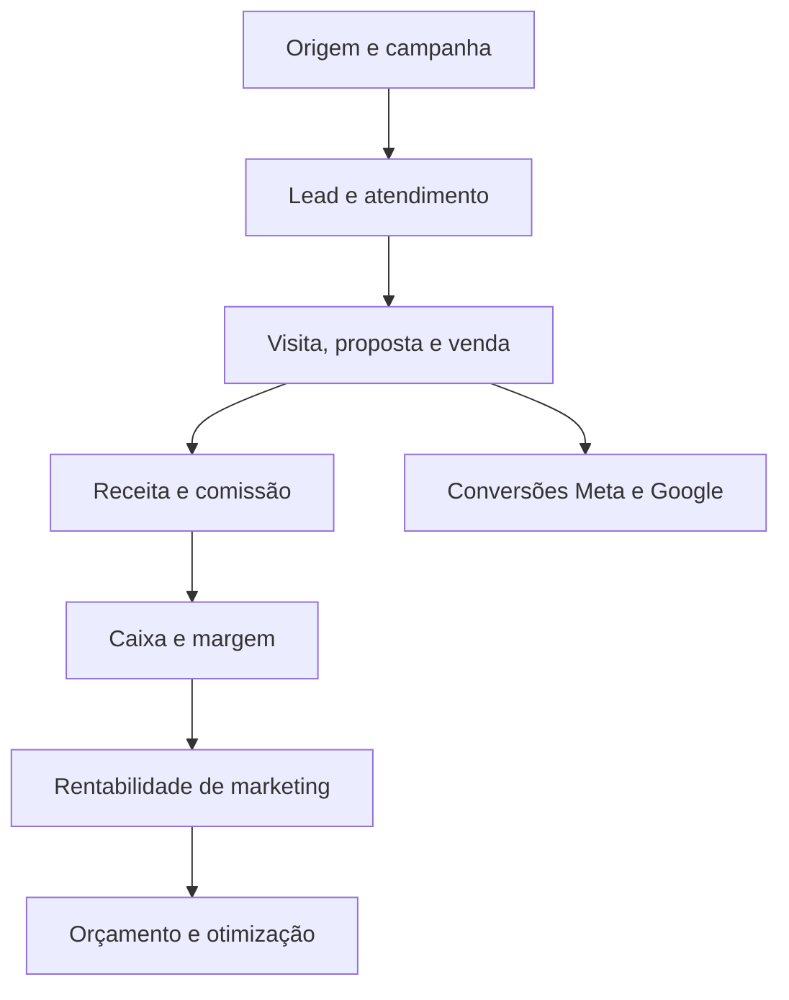
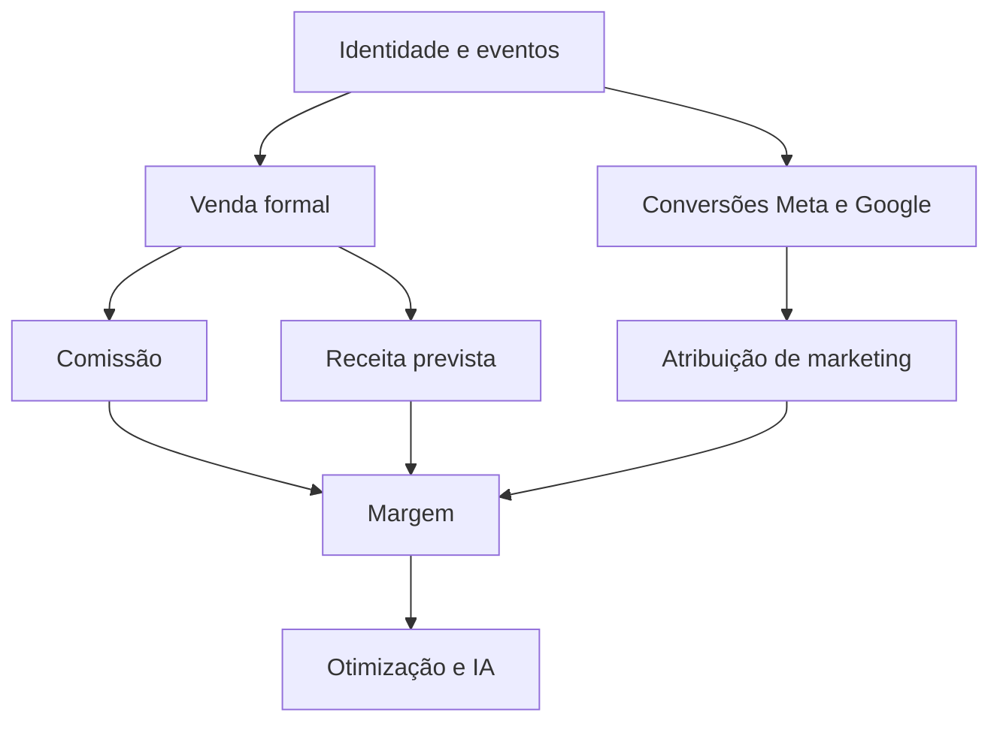

# Plano Mestre Next Home

> A execução deste plano é acompanhada em [STATUS_EXECUCAO_PLANO_MESTRE.md](./STATUS_EXECUCAO_PLANO_MESTRE.md). O plano preserva as decisões estratégicas; o acompanhamento registra entregas, evidências e bloqueios.

## Produto, financeiro empresarial, marketing e plano de execução

**Documento consolidado · 29 de agosto de 2026**  
**Aplicação analisada:** Next Home  
**Versão:** 3 — estratégia, tráfego pago e execução  
**Objetivo:** reunir o diagnóstico de mercado, os roadmaps financeiro e de marketing e o plano necessário para transformar a estratégia em entregas verificáveis.

---

## 1. Resumo executivo

O Next Home já deixou de ser apenas uma vitrine de imóveis. A aplicação atual possui CRM, funil, atendimento no WhatsApp com IA, qualificação, visitas, tarefas, campanhas, follow-ups, ingestão de materiais, gestão de imóveis e métricas de anúncios da Meta.

As três maiores oportunidades agora estão nas pontes entre módulos:

1. **Marketing → comercial:** saber qual anúncio, campanha, busca ou conteúdo gerou o lead e quais contatos chegaram a visita, proposta e venda.
2. **Comercial → financeiro:** transformar reserva e venda em receita prevista, comissão, obrigação, recebimento e margem.
3. **Financeiro → marketing:** devolver às plataformas de mídia as conversões qualificadas e calcular o retorno usando receita e margem reais.

O produto deve ocupar uma posição clara:

> **O sistema operacional da imobiliária que conecta campanha, atendimento, venda, comissão, caixa e rentabilidade.**

Não é necessário reconstruir um ERP, uma plataforma de mídia ou uma ferramenta contábil. O Next Home deve possuir nativamente a inteligência específica do negócio imobiliário e integrar os serviços externos que já executam bem tarefas genéricas ou reguladas.

### As primeiras cinco entregas

| Ordem | Entrega | Resultado esperado |
|---|---|---|
| **1** | Fundação de medição e identidade de campanha | Todo lead chega com origem, campanha e identificadores preservados |
| **2** | Conversões offline para Meta e Google | As plataformas passam a aprender com lead qualificado, visita e venda |
| **3** | Motor de comissão e extrato do corretor | Venda vira receita prevista e obrigação rastreável |
| **4** | Painel de rentabilidade de marketing | Gasto é comparado com venda, receita e margem |
| **5** | Catálogo imobiliário dinâmico e SEO operacional | Imóveis disponíveis alimentam anúncios e páginas indexáveis automaticamente |

---

## 2. Estado atual da aplicação

### Capacidades já existentes

- Vitrine pública de imóveis e empreendimentos.
- SEO básico por imóvel, com título e descrição próprios.
- CRM de leads, etapas, tarefas, visitas e histórico.
- Distribuição e gestão por corretor/equipe.
- WhatsApp com múltiplas instâncias, IA Sofia e histórico no CRM.
- Qualificação por renda, orçamento, dormitórios, região e empreendimento.
- Campanhas e filas de disparo no WhatsApp.
- Follow-ups automáticos, lembretes e tentativas de contato.
- Controles de cota, espaçamento, janela e disjuntor de campanhas.
- Entrada de Lead Ads da Meta por webhook.
- Sincronização de gasto e resultados diários da Meta por campanha.
- Links de campanha e links personalizados por corretor.
- Dossiê e temperatura do lead.
- Ingestão de materiais de imóveis por PDF e Google Drive.
- Histórico e reconciliação de preços.

### Lacunas confirmadas no repositório

Não foram encontrados módulos completos para:

- Google Ads, GA4 ou Search Console;
- taxonomia unificada de eventos de marketing;
- armazenamento persistente de UTMs e identificadores de clique em todos os pontos de entrada;
- atribuição de visita, proposta, venda, receita ou margem à campanha;
- envio de conversões de CRM para Meta e Google;
- catálogo imobiliário sincronizado com anúncios dinâmicos;
- audiências sincronizadas com plataformas de mídia;
- consentimento, preferências e supressão por canal;
- experimentos de landing page;
- gestão de reputação do Google Business Profile;
- comissão, contas a pagar/receber, DRE gerencial ou fluxo de caixa.

Os campos `orcamento_min` e `orcamento_max` existentes representam a capacidade de compra do cliente, não o orçamento empresarial.

---

## 3. Diagnóstico de mercado consolidado

O documento de pesquisa anterior registrou 1.082 funcionalidades mapeadas em oito plataformas, organizadas em atendimento, administração de lead, financeiro e marketing. Parte da amostra foi verificada de forma adversarial, mas o próprio levantamento ressalvou que nem todas as 1.082 alegações foram confirmadas individualmente.

### 3.1 Next Home e o incumbente cobrem metades opostas do funil

O fornecedor que ocupa atualmente o domínio histórico da empresa é forte em levar imóveis até o lead: hospedagem, e-mail, modelos de site e distribuição para portais. Sua profundidade documentada depois que o lead chega é limitada.

O Next Home é o inverso: já possui atendimento, IA, histórico, funil, follow-up e operação comercial. Para substituir o incumbente sem regressão, precisa cobrir a infraestrutura e distribuição essenciais, mas não deve perder o foco na parte em que já é superior.

### 3.2 A migração do domínio continua sendo uma dependência crítica

O domínio histórico possui URLs e autoridade acumulada. A mudança para a aplicação nova deve seguir um inventário de URLs, mapeamento individual e redirects permanentes. O Google recomenda mapear URLs antigas para seus novos destinos e usar redirects permanentes durante mudanças de site.

Fonte: [Google Search Central — migração de site](https://developers.google.com/search/docs/crawling-indexing/site-move-with-url-changes) e [redirects](https://developers.google.com/search/docs/crawling-indexing/301-redirects).

### 3.3 O atendimento é uma vantagem real

A combinação de IA conversacional, memória, foco da conversa, catálogo, qualificação, histórico e follow-up coloca a aplicação à frente de produtos que usam IA apenas para escrever descrições ou posts.

Essa vantagem precisa ser demonstrada por métricas:

- tempo até a primeira resposta;
- disponibilidade efetiva da IA;
- taxa de resposta do cliente;
- avanço para qualificação;
- agendamento de visita;
- conversão por origem e corretor.

### 3.4 O financeiro especializado é uma oportunidade defensável

Plataformas de marketing e CRMs básicos raramente conectam comissão, VGV e fluxo de recebimento. Plataformas imobiliárias de ponta alta já possuem módulos robustos, confirmando que a necessidade existe.

O diferencial do Next Home não será apenas “ter comissão”, mas ligar a comissão à conversa, ao imóvel, ao corretor, à campanha e à margem.

### 3.5 Conteúdo genérico por IA deixou de ser diferencial

Gerador de descrição, legenda e post deve continuar como recurso de produtividade, mas não deve liderar o roadmap. O valor mais raro está na inteligência do lado de quem compra e de quem gere a operação:

- busca por linguagem natural;
- recomendação de imóveis;
- personalização por perfil;
- atribuição até a venda;
- catálogo dinâmico para mídia;
- rentabilidade por campanha;
- automações de recuperação e nutrição.

---

## 4. Roadmap geral de produto

### Prioridade imediata

1. Preparar migração de domínio, URLs, redirects, e-mail e Search Console.
2. Medir SLA de primeira resposta e falhas do atendimento automático.
3. Criar simulador de financiamento ligado ao lead e ao WhatsApp.
4. Criar venda como entidade formal do sistema.
5. Implementar comissão e receita prevista.
6. Fechar o ciclo de conversão com Meta e Google.

### Próximas capacidades comerciais

- Agenda com disponibilidade real e confirmação de visita.
- Proposta, documentos, reserva e assinatura eletrônica.
- SLA por corretor e redistribuição automática por inatividade.
- Radar bidirecional cliente ↔ imóvel.
- Portfólio personalizado por cliente, favoritos e comparação.
- Espelho de vendas e disponibilidade de unidades em tempo real.
- Metas e ranking com indicadores de qualidade, não apenas volume.

### Itens que só sobem de prioridade com evidência

- Distribuição para muitos portais.
- Grande biblioteca de temas de site.
- Geração massiva de posts por IA.
- Funcionalidades sociais sem ligação com lead e venda.

Esses itens podem ser úteis, mas devem competir com base em dados de origem, conversão e receita.

---

# Parte I — Roadmap Financeiro Empresarial

## 5. Decisão de arquitetura financeira

O Next Home não deve tentar virar um ERP contábil genérico. A oportunidade está em construir uma camada financeira especializada no negócio imobiliário, capaz de responder:

- Quanto de receita cada reserva e venda deve gerar?
- Quando essa receita deve entrar no caixa?
- Quanto será repassado a corretor, captador, gerente e parceiro?
- Qual empreendimento, corretor ou campanha deixa margem?
- Quanto do pipeline comercial pode virar caixa?
- Onde estão atrasos, distratos, estornos e divergências?

Banco, conciliação, pagamentos, emissão fiscal e escrituração devem entrar por integração. O Next Home será a fonte da verdade comercial; o ERP continuará como fonte da verdade financeira e fiscal.

## 6. As três camadas financeiras

| Camada | Responsabilidade | Estratégia |
|---|---|---|
| **Financeiro comercial imobiliário** | VGV, venda, receita de intermediação, comissão, distrato e margem | Construir nativamente |
| **Tesouraria operacional** | Contas a pagar/receber, baixas, extrato, conciliação e caixa | Orquestrar e integrar |
| **Fiscal e contábil** | NFS-e, impostos, escrituração e fechamento oficial | Integrar com ERP e contador |

O painel deve mostrar a procedência de cada número: calculado pelo CRM, sincronizado do ERP, conciliado no banco ou confirmado pela contabilidade.

## 7. Benchmark financeiro

### Comissão imobiliária

As referências especializadas incluem regra parametrizável, divisão entre participantes, programação de parcelas e estados de autorização, liberação, cancelamento e pagamento.

Fontes: [CV CRM — configuração de comissões](https://ajuda.cvcrm.com.br/support/solutions/articles/157000357242-configura%C3%A7%C3%A3o-de-comiss%C3%B5es-painel-do-gestor), [integração CV–Sienge](https://ajuda.cvcrm.com.br/support/solutions/articles/157000357155-integra%C3%A7%C3%A3o-cv-e-sienge-integrac%C3%B5es-e-api) e [relatório de fluxo mensal](https://ajuda.cvcrm.com.br/support/solutions/articles/157000359239-relat%C3%B3rio-de-fluxo-mensal).

### Tesouraria e integração

Omie e Conta Azul expõem contas a pagar/receber, parcelas, baixas, categorias, centros de custo, saldos, extrato e previsto versus realizado. Isso permite sincronizar um ERP em vez de duplicá-lo.

Fontes: [APIs da Omie](https://developer.omie.com.br/service-list/), [aprovação de pagamentos](https://ajuda.omie.com.br/pt-BR/articles/5985837-configurando-a-aprovacao-de-pagamentos), [API financeira da Conta Azul](https://developers.contaazul.com/docs/financial-apis-openapi) e [API de baixas](https://developers.contaazul.com/docs/acquittance-apis-openapi).

### Planejamento e caixa

Referências de FP&A trabalham com orçamento versionado, realizado versus previsto e cenários. A Oracle recomenda previsão rolante de 13 semanas como horizonte operacional de caixa.

Fontes: [Oracle — previsão de 13 semanas](https://docs.oracle.com/en/cloud/saas/planning-budgeting-cloud/pcf-create-applications/index.html), [planejamento e cenários](https://docs.oracle.com/en/cloud/saas/netsuite/ns-online-help/article_7160253896.html) e [Microsoft — orçamento por centro de custo](https://learn.microsoft.com/en-us/dynamics365/business-central/finance-about-cost-accounting).

## 8. Fases do financeiro

### F0 — Fundação e governança

- Empresas e unidades operacionais.
- Categorias e centros de custo.
- Dimensões: empreendimento, unidade, corretor, equipe, canal e campanha.
- Estados: rascunho, previsto, aprovado, vencido, parcialmente pago, pago, conciliado, cancelado e estornado.
- Perfis: corretor, gerente, financeiro júnior, financeiro sênior, diretor e administrador.
- Log imutável e versões das regras.
- Fechamento mensal sem alteração retroativa silenciosa.

### F1 — Motor de comissão e extrato do corretor

#### Regra de comissão

- Regra por empreendimento, período e tipo de venda.
- Participantes: vendedor, captador, gerente, imobiliária, parceiro e indicação.
- Percentual ou valor fixo.
- Base: VGV, preço de venda, receita de intermediação ou recebido.
- Comissão direta ou indireta.
- Parcelamento conforme contrato ou recebimento.
- Bônus, prêmio, desconto e teto.
- Exceção com justificativa e aprovação.
- Congelamento da regra usada na venda.

#### Jornada

`reserva → proposta aprovada → contrato → comissão prevista → parcela liberada → pagamento → conciliação`

Distrato deve gerar reversão rastreável. Comissão paga não é apagada; torna-se estorno ou saldo a compensar.

#### Extrato do corretor

- total previsto;
- parcelas e datas estimadas;
- liberado, pago, retido, estornado e a compensar;
- origem por venda, unidade e empreendimento;
- memória de cálculo;
- comprovante e contestação.

### F2 — Receita e fluxo de caixa

- Contas a receber originadas de vendas/comissões.
- Contas a pagar de comissionados, mídia e fornecedores.
- Parcelas, baixas parciais, juros, multa, desconto e anexo.
- Caixa diário de 30 dias.
- Caixa semanal de 13 semanas.
- Cenários base, conservador e otimista.
- Alertas de saldo mínimo, concentração e atraso.
- Aprovações por alçada.

| Classe | Exemplo | Uso no forecast |
|---|---|---|
| **Confirmado** | Parcela contratada e aprovada | Entra integralmente |
| **Provável** | Proposta aprovada, contrato pendente | Entra ponderada |
| **Comercial** | Lead em visita ou negociação | Aparece apenas em cenário |
| **Realizado** | Baixa conciliada | Compõe histórico efetivo |

### F3 — DRE gerencial e rentabilidade

- receita bruta de intermediação;
- deduções e impostos estimados/importados;
- comissão e premiação;
- mídia atribuída;
- outros custos variáveis;
- margem de contribuição;
- despesas por centro de custo;
- resultado gerencial.

Análises por empreendimento, incorporadora, corretor, equipe, campanha, origem, competência e caixa.

### F4 — Integrações

Escolher primeiro o ERP já usado pela empresa. O conector sincroniza pessoas, categorias, centros de custo, contas, títulos, parcelas, baixas, saldos e identificadores externos.

Requisitos técnicos:

- OAuth/credenciais por empresa;
- `source_system` e `external_id`;
- idempotência;
- cursor de sincronização;
- fila de erro reprocessável;
- detecção de conflito;
- trilha de alteração.

Banco deve começar por OFX ou extrato do ERP e evoluir para Open Finance por parceiro autorizado. Fiscal deve ser delegado ao ERP sempre que possível, seguindo a [documentação nacional da NFS-e](https://www.gov.br/nfse/pt-br/biblioteca/documentacao-tecnica/documentacao-atual).

### F5 — Copiloto financeiro

- responder perguntas com memória de cálculo;
- explicar desvios;
- detectar duplicidade e anomalia;
- resumir fechamento;
- simular investimento em mídia, contratação e atraso;
- elaborar rascunho de orçamento.

A IA não executa pagamento, aprova despesa, muda comissão ou emite nota sem confirmação e permissão.

## 9. Modelo de dados financeiro

| Entidade | Função |
|---|---|
| `financeiro_empresas` | Empresa/unidade |
| `financeiro_contas` | Caixa, banco e contas transitórias |
| `financeiro_categorias` | Classificação de receitas/despesas |
| `financeiro_centros_custo` | Responsabilidade gerencial |
| `financeiro_lancamentos` | Evento a pagar/receber |
| `financeiro_parcelas` | Cronograma e status |
| `financeiro_baixas` | Pagamentos e recebimentos |
| `financeiro_conciliacoes` | Baixa ↔ movimento bancário |
| `financeiro_orcamentos` | Planejado por período/dimensão |
| `financeiro_cenarios` | Premissas versionadas |
| `financeiro_aprovacoes` | Alçada e decisão |
| `financeiro_eventos` | Auditoria append-only |
| `vendas` | Fato comercial central |
| `regras_comissao` | Regra versionada |
| `comissoes` | Cálculo congelado |
| `comissao_participantes` | Rateio por pessoa/papel |
| `comissao_parcelas` | Previsto, liberado, pago e estornado |

## 10. Indicadores financeiros

1. VGV vendido.
2. Receita bruta contratada.
3. Receita recebida e conciliada.
4. Comissão a receber e a pagar.
5. Margem de contribuição.
6. Aging de recebíveis.
7. Acurácia do forecast.
8. Concentração de recebimentos.
9. CAC por venda.
10. Retorno sobre margem.

“Venda”, “VGV”, “receita contratada” e “dinheiro recebido” precisam ter definições separadas em todas as telas.

---

# Parte II — Roadmap de Marketing Imobiliário

## 11. Decisão central de marketing

O Next Home não deve competir com o Gerenciador de Anúncios da Meta, o Google Ads, o Canva ou uma plataforma genérica de e-mail. Deve se tornar a camada que essas ferramentas não possuem: a inteligência comercial e financeira da imobiliária.

A pergunta do painel não será apenas “quantos leads a campanha gerou?”, mas:

- Quantos foram atendidos dentro do SLA?
- Quantos tinham renda e perfil compatíveis?
- Quantos visitaram, receberam proposta e compraram?
- Qual imóvel ou empreendimento despertou interesse?
- Quanto de VGV, receita e margem a campanha produziu?
- Quais sinais devem voltar para Meta e Google otimizarem a próxima entrega?

### Construir versus integrar

| Construir no Next Home | Integrar |
|---|---|
| Identidade do lead e linha do tempo de touchpoints | Compra de mídia Meta/Google |
| Taxonomia imobiliária de eventos | Entrega de anúncios |
| Atribuição até venda, receita e margem | GA4, Search Console e Business Profile |
| Mapeamento campanha ↔ empreendimento ↔ corretor | WhatsApp Business Platform/e-mail |
| Lead score e intenção por imóvel | Editores de imagem/vídeo |
| Segmentos e jornadas do CRM | Algoritmos de lances das plataformas |
| Catálogo canônico e disponibilidade | Redes de anúncios e portais |

## 12. Benchmark de marketing

### Meta: CRM, catálogo e conversão

A Meta oferece três blocos diretamente relevantes:

1. **Conversions API para CRM:** envio de eventos posteriores ao lead, como qualificação e venda.
2. **Home Listings Catalog:** catálogo específico de imóveis para anúncios dinâmicos.
3. **Custom Audiences:** audiências construídas com comportamento do site e dados fornecidos ao CRM.

Fontes: [Conversions API para CRM](https://developers.facebook.com/documentation/ads-commerce/conversions-api/conversion-leads-integration), [anúncios imobiliários](https://developers.facebook.com/documentation/ads-commerce/marketing-api/real-estate-ads/get-started), [Home Listings](https://developers.facebook.com/documentation/ads-commerce/marketing-api/reference/product-catalog/home_listings) e [Custom Audiences](https://developers.facebook.com/documentation/ads-commerce/marketing-api/audiences).

### Google: evento, atribuição e mídia

O Google recomenda eventos padronizados para geração, qualificação e conversão de leads. Enhanced Conversions for Leads combina identificadores de clique e dados próprios protegidos por hash para melhorar a ligação entre CRM e campanha. A Google Ads API disponibiliza custo e conversões por campanha.

Fontes: [eventos recomendados do GA4](https://support.google.com/analytics/answer/9267735), [métricas de leads](https://support.google.com/analytics/table/13948007), [Enhanced Conversions for Leads](https://support.google.com/google-ads/answer/15713840) e [relatórios de conversão da Google Ads API](https://developers.google.com/google-ads/api/docs/conversions/reporting).

### CRM e automação

HubSpot e Salesforce tratam scoring, histórico de engajamento, nutrição, visão unificada e ligação de marketing com pipeline como capacidades centrais. O aprendizado aplicável é manter o motivo do score visível e usar dados comerciais para suprimir ou personalizar marketing.

Fontes: [HubSpot — lead scoring](https://knowledge.hubspot.com/scoring/understand-the-lead-scoring-tool), [score preditivo](https://knowledge.hubspot.com/properties/determine-likelihood-to-close-with-predictive-lead-scoring) e [Salesforce — marketing e vendas unidos](https://www.salesforce.com/marketing/b2b-automation/).

### Reputação e presença local

As APIs do Google Business Profile permitem administrar informações, posts, avaliações e métricas de interação da empresa.

Fontes: [visão geral do Business Profile](https://developers.google.com/my-business/ref_overview) e [dados de avaliações](https://developers.google.com/my-business/content/review-data).

### Privacidade e mensageria

Marketing precisa registrar finalidade, base legal, transparência, oposição e preferência por canal. A ANPD orienta que o uso de legítimo interesse seja avaliado e documentado quanto à finalidade, necessidade e balanceamento. Para WhatsApp, a Meta exige opt-in antes de mensagens iniciadas pela empresa e usa templates para marketing.

Fontes: [ANPD — legítimo interesse](https://www.gov.br/anpd/pt-br/centrais-de-conteudo/materiais-educativos-e-publicacoes/guia_orientativo_hipoteses_legais_tratamento_de_dados_pessoais_legitimo_interesse), [opt-in do WhatsApp](https://developers.facebook.com/documentation/business-messaging/whatsapp/getting-opt-in) e [templates de marketing](https://developers.facebook.com/documentation/business-messaging/whatsapp/marketing-messages/send-marketing-messages).

## 13. Fases do marketing

### M0 — Fundação de medição

Essa fase deve preceder novos painéis. Sem identidade e taxonomia consistentes, qualquer atribuição será apenas aparência de precisão.

#### Origem e identidade

- Preservar `utm_source`, `utm_medium`, `utm_campaign`, `utm_content` e `utm_term`.
- Preservar `fbclid`, `gclid`, `wbraid` e demais identificadores aceitos pelas plataformas.
- Criar `campaign_key` canônica para relacionar anúncio, link, lead, conversa e venda.
- Registrar primeiro toque, último toque e todos os touchpoints relevantes.
- Unificar duplicidades por telefone/e-mail com regras determinísticas e revisão em casos ambíguos.
- Manter origem original mesmo quando o lead muda de corretor ou etapa.

#### Taxonomia de eventos

| Evento Next Home | Significado | Destinos possíveis |
|---|---|---|
| `view_property` | Visualizou imóvel/empreendimento | GA4, Meta |
| `search_property` | Pesquisou com filtros ou texto livre | GA4 |
| `contact_whatsapp` | Abriu/iniciou contato | GA4, Meta |
| `generate_lead` | Lead criado | GA4, Meta, Google Ads |
| `qualify_lead` | Perfil mínimo confirmado | GA4, Meta, Google Ads |
| `schedule_visit` | Visita agendada | Meta, Google Ads |
| `complete_visit` | Visita realizada | Meta, Google Ads |
| `submit_proposal` | Proposta registrada | Meta, Google Ads |
| `close_convert_lead` | Venda confirmada | GA4, Meta, Google Ads |
| `receive_revenue` | Receita recebida | BI interno; mídia apenas quando a política permitir |

Cada evento precisa de ID único para deduplicação, timestamp, lead, corretor, empreendimento, campanha, origem, consentimento e versão do schema.

#### Qualidade da coleta

- painel de eventos recebidos, enviados, rejeitados e duplicados;
- atraso entre acontecimento e envio;
- taxa de correspondência por plataforma;
- fila de reprocessamento;
- testes automáticos de payload;
- ambiente de homologação.

### M1 — Fechar o ciclo com Meta e Google

Essa é a maior oportunidade de marketing no curto prazo porque metade dos dados já existe.

#### Meta Conversions API para CRM

- Enviar lead criado, lead qualificado, visita, proposta e venda.
- Utilizar ID de evento estável e deduplicação.
- Enviar apenas campos permitidos e necessários.
- Monitorar aceitação, qualidade de correspondência e erros.
- Criar mapeamento configurável entre etapa interna e evento da plataforma.

#### Google Enhanced Conversions for Leads

- Capturar identificadores de clique na entrada.
- Preservar dados próprios normalizados e protegidos conforme requisitos da plataforma.
- Importar qualificação, visita, proposta e venda.
- Enviar valor apenas com definição financeira consistente.
- Monitorar diagnóstico e atraso de upload.

#### Regra de ouro

Não otimizar anúncios apenas para formulário preenchido. A hierarquia de valor deve ser:

`lead → lead qualificado → visita realizada → proposta → venda`

Nos primeiros ciclos, eventos de menor volume continuam sendo observados, mas a plataforma recebe sinais suficientes para aprender sobre qualidade.

### M2 — Cockpit de aquisição e rentabilidade

Unificar Meta e Google numa visão própria:

- conta, campanha, conjunto/grupo, anúncio e criativo;
- gasto, impressões, alcance, cliques e resultados da plataforma;
- leads únicos do CRM;
- leads qualificados;
- visitas, propostas e vendas;
- VGV, receita contratada, receita recebida e margem;
- custo por etapa;
- divergência entre resultado contado pela mídia e pelo CRM.

#### Modelos de atribuição

Começar simples e transparente:

1. **Origem original:** primeiro toque conhecido.
2. **Último não direto:** último canal identificável antes do lead.
3. **Assistido:** lista de touchpoints que participaram.

Modelos linear, em U ou orientado por dados só devem ser adicionados quando houver volume e identidade suficientes. O painel sempre informa modelo, janela e data da última atualização.

#### Orçamento

- orçamento mensal por canal/campanha;
- realizado versus orçado;
- projeção de gasto ao final do mês;
- alerta de ritmo acima/abaixo do plano;
- recomendação de realocação baseada em lead qualificado, venda e margem;
- aprovação humana antes de qualquer alteração externa.

### M3 — Catálogo imobiliário e remarketing dinâmico

O cadastro de imóveis existente deve se tornar a fonte canônica de feeds.

#### Feed Home Listings para Meta

- ID estável da unidade/imóvel.
- URL canônica e link profundo.
- título, descrição, imagens e endereço.
- preço e moeda.
- tipologia, dormitórios, banheiros e área.
- empreendimento e incorporadora.
- disponibilidade: disponível, reservado, vendido ou indisponível.
- atualização incremental e feed completo de segurança.
- relatório de itens rejeitados, desatualizados ou sem imagem.

#### Segmentos de catálogo

- lançamento;
- região;
- faixa de preço;
- dormitórios;
- pronto ou em construção;
- Minha Casa Minha Vida/SBPE quando aplicável;
- imóvel visitado ou semelhante ao interesse do lead.

#### Experiências geradas

- anúncio mostra exatamente o imóvel visto;
- se a unidade sair de disponibilidade, recomenda alternativas;
- corretor envia seleção dinâmica ao cliente;
- campanha pode ser medida por empreendimento e margem.

### M4 — Audiências e jornada de nutrição

#### Construtor de segmentos

Segmentos devem combinar atributos e comportamento:

- região, renda e faixa de compra;
- tipologia e dormitórios;
- empreendimento visualizado;
- temperatura do lead;
- última interação;
- visita realizada ou não comparecida;
- proposta sem fechamento;
- cliente antigo com potencial de indicação;
- consentimento e preferência por canal.

#### Sincronização de audiências

- Meta Custom Audiences.
- Google Customer Match, quando a conta cumprir os requisitos.
- listas de inclusão e de supressão.
- atualização incremental.
- exclusão rápida quando houver oposição ou retirada de permissão.
- histórico do tamanho enviado e taxa de correspondência.

Meta e Google permitem audiências baseadas em dados próprios, mas o recurso deve ser condicionado à base legal e às políticas das plataformas. Fontes: [Meta Custom Audiences](https://developers.facebook.com/documentation/ads-commerce/marketing-api/audiences/guides/custom-audiences) e [Google Customer Match](https://support.google.com/google-ads/answer/6379332).

#### Jornadas

- novo lead sem resposta;
- lead qualificado sem visita;
- visita agendada;
- não comparecimento;
- visita sem proposta;
- proposta parada;
- imóvel indisponível com alternativa;
- reativação por novo lançamento compatível;
- pós-venda e pedido de indicação.

Cada jornada precisa de entrada, saída, pausa, limite de frequência, janela de horário, canal permitido e meta de conversão.

#### WhatsApp

O sistema atual possui campanhas e anti-ban, mas a evolução precisa separar a lógica de jornada do provedor de envio. Assim, a operação pode usar o canal atual e migrar ou complementar com WhatsApp Business Platform oficial sem reescrever segmentação, consentimento e histórico.

### M5 — Lead score e recomendação imobiliária

O Next Home já possui temperatura e dossiê. O próximo passo é separar três dimensões:

1. **Fit:** renda, crédito, região, tipologia, prazo e orçamento.
2. **Engajamento:** respostas, visitas ao site, imóveis vistos, retorno ao WhatsApp e recência.
3. **Intenção:** simulação, visita, proposta, documentos e sinais de decisão.

O score precisa mostrar fatores positivos e negativos, histórico e confiança. Não deve esconder a fila inteira atrás de um número opaco.

#### Radar cliente ↔ imóvel

- imóveis mais aderentes a um cliente;
- clientes mais aderentes a uma nova unidade;
- explicação da compatibilidade;
- alerta de mudança de preço/disponibilidade;
- geração de seleção personalizada;
- busca por texto livre e voz usando o catálogo existente.

Essa funcionalidade transforma dados de atendimento em marketing individualizado e reduz disparo irrelevante.

### M6 — SEO operacional e domínio

#### Migração segura

- exportar URLs indexadas e páginas que recebem tráfego/backlinks;
- mapear URL antiga → nova;
- aplicar 301 individual;
- preservar conteúdo e intenção da página;
- atualizar canônicos, sitemap e links internos;
- configurar domínio real em `NEXT_PUBLIC_SITE_URL`;
- validar Search Console;
- monitorar 404, cobertura, impressões e cliques antes/depois.

#### SEO programático com qualidade

- página canônica por empreendimento e imóvel elegível;
- títulos e descrições sem duplicidade;
- sitemap automático apenas com itens publicáveis;
- desindexação de páginas vazias, duplicadas ou indisponíveis sem substituto;
- páginas úteis por região e necessidade, evitando combinações infinitas de filtros;
- conteúdo local, infraestrutura, mapas e perguntas frequentes verificáveis;
- histórico de alteração e data de atualização.

#### Painel Search Console

- impressões, cliques, CTR e posição;
- consultas por empreendimento/região;
- páginas que ganharam ou perderam tráfego;
- URLs não indexadas;
- alertas de queda após publicação ou migração.

### M7 — Landing pages e experimentos

- landing por empreendimento e campanha;
- blocos reaproveitáveis com identidade Next Home;
- formulário curto e progressivo;
- clique para WhatsApp preservando campanha;
- prova social e informações verificadas;
- versão do conteúdo e responsável pela publicação;
- teste de título, hero, CTA, formulário e ordem de argumentos;
- divisão estável de tráfego e período mínimo;
- métrica principal definida antes do teste;
- resultado por lead qualificado, não apenas clique.

Google Ads já expõe relatórios de experimentos com métricas de controle, tratamento e significância; o Next Home pode importar resultados de mídia e manter experimentos próprios de landing page. Fonte: [Google Ads API — experimentos](https://developers.google.com/google-ads/api/docs/experiments/reporting).

### M8 — Reputação e presença local

- integrar Google Business Profile;
- consolidar novas avaliações;
- fila de resposta com rascunho assistido por IA;
- alertar avaliação negativa;
- registrar tempo de resposta;
- publicar atualizações e lançamentos aprovados;
- acompanhar ligações, rotas e interações disponíveis;
- pedir avaliação após marcos positivos, sem condicionar benefício.

### M9 — Operação de conteúdo e criativos

Não priorizar um gerador genérico. Construir uma camada operacional ligada ao resultado:

- biblioteca de ativos por empreendimento;
- direitos de uso e data de validade;
- marcação de imagem real, render ou gerada por IA;
- versões por formato/canal;
- vínculo do criativo à campanha;
- desempenho do ativo em clique, lead qualificado e venda;
- brief automático a partir de dados oficiais do imóvel;
- aprovação antes de publicação;
- prevenção de uso de preço ou condição vencida.

Canva, Runway e ferramentas de criação podem ser integrados futuramente; o diferencial próprio será governança, dados confiáveis e performance do ativo.

## 14. Modelo de dados de marketing

| Entidade | Função |
|---|---|
| `marketing_contas` | Contas Meta, Google e outros canais |
| `marketing_campanhas` | Identidade canônica de campanha |
| `marketing_anuncios` | Conjunto/grupo, anúncio e criativo |
| `marketing_metricas_diarias` | Custo e métricas agregadas |
| `marketing_touchpoints` | Interações identificáveis do lead |
| `marketing_eventos` | Eventos próprios com deduplicação |
| `marketing_conversoes_envio` | Fila e retorno Meta/Google |
| `marketing_atribuicoes` | Crédito por modelo e janela |
| `marketing_ativos` | Imagens, vídeos, textos e permissões |
| `marketing_catalogos` | Feed, versão e integridade |
| `marketing_catalogo_itens` | Unidade/imóvel e status por destino |
| `marketing_segmentos` | Regras de audiência |
| `marketing_audiencias_sync` | Envios e taxa de correspondência |
| `marketing_jornadas` | Automações versionadas |
| `marketing_experimentos` | Hipótese, variantes e resultado |
| `marketing_consentimentos` | Base, finalidade, canal e histórico |
| `marketing_preferencias` | Opt-in, opt-out e frequência |
| `seo_paginas` | URL canônica, indexação e redirecionamento |

O schema deve reaproveitar as tabelas Meta e WhatsApp atuais por migração controlada ou views de compatibilidade, evitando duas verdades para a mesma campanha.

## 15. Indicadores de marketing

### Aquisição

- gasto, alcance, impressões e frequência;
- CTR e CPC;
- leads únicos e CPL;
- taxa de duplicidade;
- origem conhecida versus desconhecida.

### Qualidade comercial

- custo por lead qualificado;
- taxa lead → qualificação;
- tempo até primeira resposta;
- taxa de visita agendada e realizada;
- custo por visita;
- taxa de proposta;
- custo por venda.

### Resultado financeiro

- CAC por venda;
- VGV atribuído;
- receita contratada atribuída;
- receita recebida atribuída;
- margem atribuída;
- ROAS sobre receita;
- retorno sobre margem;
- payback de mídia.

### Saúde técnica

- taxa de eventos aceitos;
- atraso de envio;
- taxa de correspondência;
- itens válidos no catálogo;
- falhas de sincronização;
- URLs indexadas e erros;
- consentimentos e opt-outs processados dentro do prazo operacional.

## 16. Critérios de aceite do MVP de marketing

- Todo novo lead de campanha preserva origem, campanha e identificador de clique quando disponíveis.
- Alterar o corretor não altera a origem do lead.
- Lead duplicado consolida histórico sem perder touchpoints.
- Qualificação, visita e venda geram eventos idempotentes.
- Meta e Google exibem status de envio, aceite e erro.
- Reprocessar um evento não cria conversão duplicada.
- Painel compara gasto da plataforma com leads únicos do CRM.
- Venda mantém vínculo com campanha e modelo de atribuição.
- Receita e margem só aparecem quando o financeiro possuir definição válida.
- Opt-out interrompe novas jornadas e futuras sincronizações de audiência.
- Toda métrica possui definição, período, timezone e data de atualização.

---

# Parte III — Plano integrado de execução

## 17. Dependências entre produto, marketing e financeiro



Essa sequência define a arquitetura. Marketing precisa da venda; financeiro precisa da venda; atribuição precisa de identidade desde o primeiro contato. Por isso, `vendas` e `marketing_eventos` são fundações compartilhadas.

## 18. Sequência recomendada

### Ciclo 1 — Dados confiáveis

- taxonomia de eventos;
- UTMs e click IDs;
- campanha canônica;
- consentimento/preferências;
- venda como entidade;
- SLA de primeira resposta;
- painel de qualidade dos dados.

### Ciclo 2 — Receita e conversão

- comissão MVP;
- receita prevista;
- Meta CRM Conversions API;
- Google Enhanced Conversions for Leads;
- painel campanha → lead → visita → venda.

### Ciclo 3 — Rentabilidade

- gasto Meta + Google;
- DRE gerencial mínima;
- CAC, VGV, receita e margem por campanha;
- orçamento versus realizado;
- alertas de desvio.

### Ciclo 4 — Distribuição inteligente

- catálogo Home Listings;
- remarketing dinâmico;
- segmentos e audiências;
- radar cliente ↔ imóvel;
- jornadas com opt-in e frequência.

### Ciclo 5 — Crescimento orgânico e presença

- migração de domínio;
- Search Console;
- SEO operacional;
- landing pages e testes;
- Google Business Profile.

### Ciclo 6 — Integrações e inteligência avançada

- ERP escolhido;
- conciliação;
- caixa de 13 semanas;
- lead score explicável;
- copilotos financeiro e de marketing.

## 19. Matriz única de prioridade

| Prioridade | Funcionalidade | Esforço relativo | Impacto |
|---|---|---:|---|
| **P0** | Origem, UTMs, click IDs e eventos | M | Base de toda medição |
| **P0** | Venda como entidade central | M | Liga CRM, financeiro e mídia |
| **P0** | Migração segura do domínio | M | Protege aquisição orgânica |
| **P1** | Conversões offline Meta e Google | M | Melhora atribuição e otimização |
| **P1** | Motor de comissão + extrato | M–G | Diferencial imobiliário |
| **P1** | Painel de rentabilidade | M | Transforma gasto em decisão |
| **P1** | SLA de primeira resposta | P | Torna vantagem do atendimento mensurável |
| **P1** | Simulador ligado ao WhatsApp | P–M | Captura intenção e melhora qualificação |
| **P2** | Catálogo Home Listings | M | Remarketing e escala de campanhas |
| **P2** | Google Ads + GA4 | M | Fecha lacuna de canal e busca |
| **P2** | Caixa de 13 semanas | M | Visibilidade de liquidez |
| **P2** | Radar cliente ↔ imóvel | M–G | Personalização real |
| **P2** | Consentimento e jornadas | M | Escala com governança |
| **P3** | ERP e conciliação | G | Eficiência operacional |
| **P3** | SEO operacional/Search Console | M | Crescimento orgânico sustentável |
| **P3** | Landing pages/experimentos | M | Ganho de conversão mensurável |
| **P3** | Google Business Profile | P–M | Reputação e presença local |
| **P4** | IA financeira e de marketing | G | Depende de dados confiáveis |

## 20. O que não construir agora

- ERP contábil completo.
- Plataforma própria de compra de mídia.
- Editor de imagem/vídeo genérico.
- Gerador de posts como principal aposta.
- Modelo de atribuição algorítmico sem volume.
- Pagamentos automáticos por IA.
- Dezenas de portais sem medir retorno atual.
- Grande biblioteca de templates antes da migração do domínio.

## 21. Decisões necessárias

### Financeiro

1. Qual ERP e banco são usados hoje?
2. Quem paga a comissão em cada modelo de venda?
3. Quando a comissão nasce e quando é liberada?
4. Quais papéis participam do rateio?
5. Como tratar distrato, inadimplência e adiantamento?

### Marketing

1. A empresa já anuncia no Google Ads ou apenas na Meta?
2. Quais contas, pixels/datasets e propriedades GA4 pertencem à empresa?
3. Qual evento é hoje considerado sucesso: lead, visita, proposta ou venda?
4. Qual regra de atribuição é usada nas decisões atuais?
5. Como o cliente autoriza contato e campanhas por WhatsApp?
6. O domínio atual, Search Console e Google Business Profile estão sob qual conta?
7. Quais empreendimentos possuem dados confiáveis de preço e disponibilidade para feed?

## 22. Limites e governança

- A DRE descrita é gerencial e não substitui a contabilidade.
- Cálculo tributário e NFS-e exigem validação contábil/fiscal.
- Dados bancários devem entrar por integração autorizada; nunca armazenar senha de banco.
- Dados usados em audiências e conversões exigem finalidade, minimização e controles compatíveis com LGPD e políticas das plataformas.
- Opt-out deve valer para todos os caminhos de envio relacionados à finalidade correspondente.
- Valores e condições de imóveis precisam de data de validade e fonte.
- Imagens geradas por IA ou renders devem ser identificadas quando puderem induzir o consumidor a erro.
- Recomendações de orçamento e campanha precisam de aprovação humana.
- Toda automação relevante deve ter pausa, log, limite e mecanismo de reversão.

## 23. Resultado esperado

Ao final deste plano, o Next Home terá uma cadeia única de evidência:

`campanha → lead → atendimento → qualificação → visita → proposta → venda → receita → comissão → caixa → margem`

O marketing saberá quais contatos viraram negócio. O financeiro saberá de onde veio a receita. O corretor acompanhará sua comissão. O gestor poderá decidir orçamento, equipe e empreendimento com base em margem e caixa, não apenas em quantidade de leads.

Esse é o diferencial central do produto: conectar funções que o mercado normalmente entrega em sistemas separados.

---

# Parte IV — Ferramentas de Plataformas de Tráfego Pago

## 24. Objetivo da camada de mídia paga

O Next Home não precisa substituir os gerenciadores de anúncio. A oportunidade é criar uma central que conecte várias contas de mídia ao CRM e permita:

- comparar canais com as mesmas definições;
- receber leads em tempo real;
- devolver qualificação, visita, proposta e venda;
- acompanhar orçamento, ritmo de gasto e anomalias;
- ligar campanha, criativo e imóvel à receita e à margem;
- criar audiências a partir do CRM;
- planejar palavras-chave, públicos e testes;
- executar alterações externas apenas com aprovação e trilha de auditoria.

A implantação deve começar em modo de leitura. Escritas como pausar campanha, alterar orçamento, publicar anúncio ou enviar audiência entram depois de validação, permissões e aprovação humana.

## 25. Matriz das plataformas

| Plataforma | Ferramentas oficiais relevantes | Uso imobiliário | Prioridade |
|---|---|---|---|
| **Meta Ads** | Marketing API, Insights, Lead Ads, Conversions API, Home Listings, Custom Audiences, regras e campanhas Advantage+ | Canal já integrado, anúncios de imóveis, WhatsApp, remarketing e escala | **P0** |
| **Google Ads** | Search, Performance Max, Demand Gen, Keyword Planner, Lead Forms, Enhanced Conversions, Customer Match, experimentos e simulações | Captura de intenção, pesquisas locais e leads qualificados | **P0** |
| **TikTok Ads** | Instant Forms, Smart+ Lead Generation, CRM Webhooks, Events API, Pixel e Messaging Ads | Descoberta por vídeo, lançamento e conversa no WhatsApp | **P1** |
| **LinkedIn Ads** | Campaign API, Lead/Conversion tracking, Audience Insights, Matched Audiences e reporting | Investidor, alta renda profissional, parceiros, incorporadoras e recrutamento | **P2** |
| **Microsoft Ads** | UET, Conversions API, offline conversions, Performance Max, remarketing e reporting | Busca complementar ao Google | **P3** |
| **Pinterest Ads** | Campaign API, analytics, targeting e conversões | Inspiração, arquitetura, decoração e topo de funil | **P4** |
| **Snapchat Ads** | Pixel, Conversions API, lead generation e audiências | Público mais jovem; testar somente com hipótese definida | **P4** |
| **X Ads** | Pixel, Conversions API, campanhas e testes de criativo | Contextos específicos, investidores e conversas em tempo real | **P4** |

As prioridades consideram a base que o Next Home já possui, aderência ao funil imobiliário e maturidade das integrações. Não representam uma afirmação genérica sobre participação de mercado.

## 26. Meta Ads

### Ferramentas disponíveis

#### Marketing API

Permite ler e gerenciar a hierarquia conta → campanha → conjunto → anúncio → criativo. O Next Home pode sincronizar status, objetivo, orçamento, datas, direcionamento permitido e vínculos com imóveis.

Fonte: [Meta Marketing API](https://developers.facebook.com/documentation/ads-commerce/marketing-api).

#### Ads Insights API

Fornece métricas e detalhamentos de desempenho por conta, campanha, conjunto e anúncio. A integração atual já busca gasto e resultado agregado; deve evoluir para criativo, posicionamento e resultado por etapa.

Fonte: [Meta Ads Insights API](https://developers.facebook.com/documentation/ads-commerce/marketing-api/insights).

#### Lead Ads e Webhooks

O aplicativo já recebe Lead Ads. A evolução deve incluir:

- inventário de formulários e perguntas;
- mapeamento versionado de campos;
- diagnóstico de webhook;
- recuperação de leads perdidos por leitura em lote;
- formulário e anúncio de origem visíveis no CRM;
- deduplicação e SLA por formulário.

Fonte: [Meta Lead Ads](https://developers.facebook.com/documentation/ads-commerce/marketing-api/guides/lead-ads) e [webhooks para CRM](https://developers.facebook.com/documentation/ads-commerce/marketing-api/guides/lead-ads/quickstart/webhooks-integration).

#### Conversions API para CRM

Enviar qualificação, visita, proposta e venda para medir e otimizar por resultado comercial, não apenas pelo formulário.

Fonte: [Meta Conversions API para CRM](https://developers.facebook.com/documentation/ads-commerce/conversions-api/conversion-leads-integration).

#### Advantage+ Catalog Ads for Real Estate

O catálogo `Home Listings` permite anunciar imóveis dinamicamente e retirar ou substituir itens quando a disponibilidade muda.

Fonte: [Meta Real Estate Ads](https://developers.facebook.com/documentation/ads-commerce/marketing-api/real-estate-ads) e [criação de anúncios de catálogo](https://developers.facebook.com/documentation/ads-commerce/marketing-api/real-estate-ads/ads-management).

#### Custom Audiences

Permite sincronizar segmentos do CRM, comportamento do site e engajamento. O Next Home deve enviar apenas audiências autorizadas e manter exclusões e opt-outs sincronizados.

Fonte: [Meta Custom Audiences](https://developers.facebook.com/documentation/ads-commerce/marketing-api/audiences/guides/custom-audiences).

#### Regras e proteção orçamentária

A Meta disponibiliza regras agendadas ou por gatilho. No Next Home, elas podem aparecer como uma camada adicional de governança:

- avisar quando gasto ultrapassar limite;
- pausar em anomalia severa;
- impedir campanha sem conversão configurada;
- bloquear anúncio de imóvel indisponível;
- exigir aprovação para aumento de orçamento.

Fonte: [Meta Marketing API e regras automatizadas](https://developers.facebook.com/social-technologies/marketing-api/).

### Restrição imobiliária obrigatória

Campanhas de imóveis devem declarar a categoria especial `HOUSING`, o que restringe opções de segmentação. O sistema deve validar essa configuração e impedir a publicação de campanha imobiliária como categoria comum.

Fonte: [Meta — categoria especial para imóveis](https://developers.facebook.com/documentation/ads-commerce/marketing-api/real-estate-ads) e [referência de campanhas](https://developers.facebook.com/documentation/ads-commerce/marketing-api/reference/ad-campaign-group).

### Funcionalidades a trazer para o Next Home

1. Conector completo de contas Meta.
2. Painel campanha, conjunto, anúncio e criativo.
3. Saúde de formulários e webhooks.
4. Conversões de CRM e diagnóstico de correspondência.
5. Feed Home Listings e integridade do catálogo.
6. Audiências e exclusões sincronizadas.
7. Alertas e regras com aprovação.
8. Validador de categoria especial e políticas.

## 27. Google Ads

### Ferramentas disponíveis

#### Google Ads API e reporting

Permite consultar e administrar campanhas, anúncios, ativos, métricas e conversões. O painel pode combinar custo do Google com as mesmas etapas comerciais usadas para a Meta.

Fonte: [Google Ads API](https://developers.google.com/google-ads/api) e [relatórios de conversão](https://developers.google.com/google-ads/api/docs/conversions/reporting).

#### Keyword Planner

Gera ideias de palavras-chave, volume histórico, concorrência e previsões, usando termos ou uma URL como semente. É especialmente útil para pesquisas locais como empreendimento + cidade, bairro, metragem, financiamento e lançamento.

Fonte: [Keyword Planning](https://developers.google.com/google-ads/api/docs/keyword-planning/overview) e [geração de ideias](https://developers.google.com/google-ads/api/docs/keyword-planning/generate-keyword-ideas).

O Next Home pode criar um “Radar de Demanda” que cruza:

- termos pesquisados;
- imóveis e empreendimentos disponíveis;
- páginas existentes;
- custo e concorrência;
- leads e vendas por consulta/campanha;
- lacunas de conteúdo e landing pages.

#### Search e termos de pesquisa

Relatórios de termos ajudam a identificar intenção, novas palavras e desperdício. A aplicação pode sugerir negativas, mas qualquer alteração deve ser revisada.

Fonte: [Google Ads — insights de termos](https://developers.google.com/google-ads/api/performance-max/campaign-criterion-reporting).

#### Lead Form Assets

O Google permite formulários nativos vinculados a campanhas, perguntas de contato e entrega por webhook. O Next Home deve receber esses leads pelo mesmo pipeline de ingestão da Meta e do TikTok.

Fonte: [Google Ads API — Lead Form Asset](https://developers.google.com/google-ads/api/samples/add-lead-form-asset) e [boas práticas para formulários](https://support.google.com/google-ads/answer/17051443).

#### Enhanced Conversions for Leads

Liga dados do CRM às campanhas e melhora a mensuração de conversões offline. É o equivalente prioritário da Conversions API da Meta.

Fonte: [Google — Enhanced Conversions for Leads](https://support.google.com/google-ads/answer/15713840).

#### Performance Max e Demand Gen

Performance Max distribui campanhas em vários canais do Google a partir de metas de conversão. Demand Gen trabalha descoberta visual em YouTube, Discover e Gmail. Para ambos, o sinal de qualidade precisa vir do CRM.

Fontes: [Performance Max](https://support.google.com/google-ads/answer/10724817), [boas práticas para geração de leads](https://support.google.com/google-ads/answer/13775965) e [leads de alta qualidade](https://support.google.com/google-ads/answer/13489421).

#### Customer Match

Permite usar dados próprios fornecidos pelo cliente para audiências, obedecendo requisitos de elegibilidade, política e atualização.

Fonte: [Google Customer Match](https://support.google.com/google-ads/answer/6379332).

#### Experimentos

A API oferece testes com divisão de tráfego entre controle e tratamento. O Next Home pode trazer hipóteses, duração, investimento, resultado e decisão final para a mesma área de experimentos das landing pages.

Fonte: [Google Ads Experiments](https://developers.google.com/google-ads/api/docs/experiments/overview).

#### Simulações de lance e orçamento

As simulações estimam como alterações teriam afetado custo, impressões, cliques e conversões com base no histórico. Devem ser exibidas como estimativa da plataforma, não como promessa.

Fonte: [Google Ads — Bid Simulations](https://developers.google.com/google-ads/api/docs/bid-simulations/overview).

#### Localização e chamadas

Ativos de localização conectam Google Ads ao Business Profile e podem exibir endereço, ligação e rota em Search, Maps, Display e YouTube.

Fonte: [Google Ads — Location Assets](https://support.google.com/google-ads/answer/2404182).

### Funcionalidades a trazer para o Next Home

1. Conector Google Ads e hierarquia completa.
2. Painel Search, Performance Max, Demand Gen e YouTube.
3. Radar de palavras-chave e demanda local.
4. Termos de pesquisa e sugestões de negativas.
5. Ingestão de Lead Form Assets.
6. Enhanced Conversions for Leads.
7. Customer Match e exclusões.
8. Experimentos e simulações.
9. Integração Business Profile/localização.

## 28. TikTok Ads

### Ferramentas disponíveis

#### Instant Forms

Os formulários nativos podem reduzir atrito, sincronizar leads com CRM e utilizar perguntas qualificadoras. A versão atual permite lógica condicional e encerramento para perfis não elegíveis.

Fontes: [TikTok Instant Forms](https://ads.tiktok.com/help/article/set-up-lead-generation-with-instant-form), [integração com CRM](https://ads.tiktok.com/help/article/available-crm-integrations-tiktok-lead-generation) e [lógica de qualificação](https://ads.tiktok.com/help/article/about-instant-form-question-types-and-settings).

Aplicação imobiliária:

- renda familiar;
- valor de entrada;
- região de interesse;
- quantidade de dormitórios;
- prazo de compra;
- uso de FGTS;
- agendamento ou WhatsApp na página final.

#### Smart+ Lead Generation

Automatiza parte da criação e otimização de campanhas para formulário, website, mensagens diretas ou aplicativos de mensagem.

Fonte: [TikTok Smart+ Lead Generation](https://ads.tiktok.com/help/article/about-smart-plus-lead-generation-campaigns).

#### Messaging Ads para WhatsApp

Campanhas podem direcionar para WhatsApp e otimizar por clique ou conversa quando o canal e o parceiro são compatíveis.

Fonte: [TikTok Instant Messaging Ads](https://ads.tiktok.com/help/article/how-to-set-up-tiktok-instant-messaging-ads).

#### Pixel, Events API e eventos de CRM

O Pixel mede interações do navegador; Events API adiciona uma rota servidor a servidor. Eventos padronizados são usados para relatório, otimização e audiências. O postback do CRM permite ensinar a plataforma sobre qualidade do lead.

Fontes: [TikTok Events API e Pixel](https://ads.tiktok.com/help/article/about-tiktok-pixel-for-mercado-shops) e [eventos padronizados](https://ads.tiktok.com/help/article/standard-events-parameters).

### Funcionalidades a trazer para o Next Home

1. Webhook de Instant Forms.
2. Mapeamento de perguntas qualificadoras.
3. Pixel + Events API com deduplicação.
4. Postback de lead qualificado, visita e venda.
5. Links de WhatsApp com campanha preservada.
6. Métricas de vídeo e criativo.
7. Painel Smart+ versus campanhas manuais.

### Prioridade

TikTok entra depois de Meta e Google, mas antes de canais complementares, especialmente para lançamentos com acervo forte de vídeo vertical. A integração deve começar por lead e conversão, não por criação automática de campanha.

## 29. LinkedIn Ads

### Ferramentas disponíveis

- criação e gestão de campanhas;
- Audience Insights com dados profissionais agregados;
- campanhas e criativos com relatórios;
- Insight Tag e conversões;
- Conversions API servidor a servidor;
- parâmetros UTM dinâmicos;
- métricas de receita atribuída disponíveis em integrações qualificadas.

Fontes: [gestão de campanhas](https://learn.microsoft.com/en-us/linkedin/marketing/integrations/ads/account-structure/create-and-manage-campaigns), [Audience Insights](https://learn.microsoft.com/en-us/linkedin/marketing/integrations/ads/advertising-targeting/audience-insights-overview), [reporting](https://learn.microsoft.com/en-us/linkedin/marketing/integrations/ads-reporting/ads-reporting), [Conversions API](https://learn.microsoft.com/en-us/linkedin/marketing/integrations/ads-reporting/conversions-api) e [UTMs dinâmicas](https://learn.microsoft.com/en-us/linkedin/marketing/integrations/ads-reporting/dynamic-utm-tracking).

### Casos de uso para a Next Home

- imóveis para investidores e executivos;
- campanhas de alto padrão por perfil profissional;
- parcerias com empresas e relocação;
- relacionamento com incorporadoras;
- recrutamento de corretores;
- eventos de lançamento voltados a investidores.

Não deve ser tratado como canal principal para todo imóvel residencial. Primeiro deve existir uma campanha-piloto com objetivo, público e margem suficientes.

## 30. Microsoft Advertising

### Ferramentas disponíveis

- Universal Event Tracking para comportamento, conversão e remarketing;
- Conversions API servidor a servidor;
- deduplicação entre UET e CAPI por `eventId`;
- conversões offline;
- campanhas Performance Max;
- remarketing;
- relatórios de custo, conversão, receita e ROAS.

Fontes: [Microsoft UET](https://learn.microsoft.com/en-us/advertising/guides/universal-event-tracking), [Conversions API](https://learn.microsoft.com/en-us/advertising/guides/uet-conversion-api-integration), [Performance Max](https://learn.microsoft.com/en-us/advertising/guides/performance-max) e [métricas de reporting](https://learn.microsoft.com/en-us/advertising/guides/report-attributes-performance-statistics).

### Prioridade

Implementar somente depois que o painel do Google mostrar demanda e eficiência suficientes para justificar um segundo conector de busca. A camada unificada de eventos permitirá adicionar Microsoft com pouco retrabalho.

## 31. Canais complementares

### Pinterest

A API permite gerir anúncios e recuperar analytics de campanhas. Pode ser útil em conteúdo de arquitetura, decoração, planta, inspiração e intenção de mudança, mas deve começar como teste de topo/meio de funil.

Fontes: [Pinterest API](https://developers.pinterest.com/docs/api/v5/introduction/) e [analytics de campanhas](https://developers.pinterest.com/docs/api/v5/campaigns-analytics/).

### Snapchat

Possui Pixel, Conversions API, lead generation e audiências. A plataforma recomenda usar Pixel e CAPI em conjunto. Deve entrar apenas se houver hipótese concreta de público jovem e acervo criativo adequado.

Fonte: [Snap Pixel e Conversions API](https://forbusiness.snapchat.com/advertising/snap-pixel).

### X Ads

Possui Pixel, Conversions API e campanhas de conversão. Pode servir a investidores e contextos específicos, mas não possui prioridade superior a Meta, Google ou TikTok para a operação residencial atual.

Fonte: [X — rastreamento de conversões](https://business.x.com/en/help/campaign-measurement-and-analytics/conversion-tracking-for-websites).

### Kwai e outras redes

Manter em observação e operar manualmente até existir documentação oficial, acesso de API, gasto e volume que justifiquem um conector próprio. Não criar integração por automação de tela ou scraping de gerenciador de anúncios.

## 32. Funcionalidades próprias inspiradas nas plataformas

### Central de conexões

- OAuth e contas vinculadas;
- permissões solicitadas e concedidas;
- pixels, datasets, tags e eventos conectados;
- validade do token e renovação;
- timezone, moeda e conta de cobrança;
- status da última sincronização.

### Planejador de campanhas imobiliárias

- empreendimento e unidades promovidas;
- objetivo comercial;
- público e região;
- canal e formato;
- orçamento e período;
- landing page ou WhatsApp;
- evento de otimização;
- regra de comissão e margem esperada;
- checklist de dados, políticas e aprovação.

O primeiro estágio gera briefing, nomes e links padronizados. A publicação direta entra apenas depois.

### Padrão de nomenclatura e UTMs

Exemplo:

`NH | META | DOM PARQUE | LEADS | BARUERI | AGO26`

O construtor cria:

- nome interno;
- `campaign_key` imutável;
- UTMs;
- link de WhatsApp roteado;
- vínculo com empreendimento;
- evento de conversão;
- centro de custo financeiro.

### Painel multicanal

Uma linha normalizada por conta, campanha, grupo/conjunto, anúncio e criativo, preservando também as métricas exclusivas de cada canal.

Filtros:

- plataforma;
- empreendimento;
- corretor/equipe;
- região;
- etapa do funil;
- período;
- campanha e criativo;
- modelo de atribuição.

### Ritmo de orçamento

- gasto previsto até hoje;
- gasto realizado;
- projeção até o fim do período;
- desvio percentual e em reais;
- limite por empreendimento e centro de custo;
- alerta de campanha sem entrega ou acelerada;
- saldo total do plano de mídia.

### Motor de recomendações

Recomendações explicáveis, com evidência e ação sugerida:

- campanha gastando sem lead qualificado;
- CPL baixo, mas taxa de visita ruim;
- criativo saturado por frequência;
- imóvel indisponível ainda anunciado;
- termo de busca irrelevante;
- formulário com abandono ou baixa qualidade;
- campanha próxima do limite financeiro;
- oportunidade de mover verba para campanha com maior margem.

Recomendação não é execução. Toda alteração externa informa impacto, alvo, autor e possibilidade de reversão.

### Centro de alertas e regras

Gatilhos possíveis:

- gasto diário acima do limite;
- zero leads após determinado gasto;
- custo por lead qualificado acima da meta;
- queda abrupta de entrega;
- rejeição de anúncio;
- falha de webhook ou conversão;
- token expirando;
- catálogo com item rejeitado;
- orçamento esgotando;
- imóvel vendido com campanha ativa.

### Biblioteca de criativos por resultado

- imagem/vídeo e suas variantes;
- empreendimento e promessa usada;
- formato e canal;
- gasto, impressões e frequência;
- retenção de vídeo;
- lead, lead qualificado, visita e venda;
- preço/condição que aparecia na peça;
- validade e direitos de uso.

### Laboratório de experimentos

- hipótese;
- variável testada;
- controle e tratamento;
- orçamento e duração;
- métrica principal;
- resultado da plataforma;
- resultado no CRM;
- decisão: promover, encerrar ou repetir.

## 33. Arquitetura de integração

### Camada canônica

Todas as plataformas devem convergir para objetos comuns:

- conta;
- campanha;
- grupo/conjunto;
- anúncio;
- criativo;
- métrica diária;
- lead nativo;
- evento de conversão;
- audiência;
- ação externa;
- erro de sincronização.

Campos exclusivos ficam em `platform_payload` controlado e versionado, sem substituir os campos normalizados.

### Modelo de dados adicional

| Entidade | Função |
|---|---|
| `paid_media_connections` | Conta, tokens e permissões |
| `paid_media_accounts` | Conta de anúncios e configuração |
| `paid_media_campaigns` | Campanha canônica e vínculo externo |
| `paid_media_ad_groups` | Grupo/conjunto/asset group |
| `paid_media_ads` | Anúncio e status |
| `paid_media_creatives` | Ativo e variante |
| `paid_media_metrics_daily` | Métricas normalizadas e específicas |
| `paid_media_lead_forms` | Formulários, perguntas e versões |
| `paid_media_native_leads` | Lead recebido e processamento |
| `paid_media_conversion_routes` | Evento interno → evento externo |
| `paid_media_conversion_deliveries` | Tentativa, aceite, erro e deduplicação |
| `paid_media_audiences` | Segmento e destino |
| `paid_media_budgets` | Planejado, limite e pacing |
| `paid_media_rules` | Gatilho, condição e ação permitida |
| `paid_media_actions` | Solicitação, aprovação, execução e reversão |
| `paid_media_recommendations` | Evidência, sugestão e decisão |
| `paid_media_experiments` | Teste, variantes e resultado |
| `paid_media_keyword_insights` | Ideias, volume, custo e intenção |

### Confiabilidade

- OAuth por plataforma e menor privilégio;
- criptografia e rotação de tokens;
- sincronização incremental;
- idempotência;
- backoff e limites de API;
- webhooks assinados quando disponíveis;
- fila de eventos morta e reprocessamento;
- horário e moeda normalizados;
- trilha de alterações externas;
- testes com contas/sandboxes quando oferecidos.

## 34. Ordem de implementação da mídia paga

### T0 — Leitura e normalização

- expandir Meta Insights;
- conectar Google Ads;
- campanha canônica;
- hierarquia e métricas diárias;
- painel multicanal somente leitura.

### T1 — Leads e conversões

- manter Lead Ads Meta;
- adicionar Google Lead Forms;
- Meta CRM Conversions API;
- Google Enhanced Conversions for Leads;
- diagnóstico, deduplicação e reprocessamento.

### T2 — Orçamento e governança

- orçamento por campanha/empreendimento;
- pacing;
- alertas;
- centro de custo;
- aprovação e log de ações.

### T3 — Catálogo e audiências

- Home Listings Meta;
- segmentos do CRM;
- Custom Audiences e Customer Match;
- exclusões e opt-out.

### T4 — Google Intelligence

- Keyword Planner;
- termos de pesquisa;
- radar de demanda;
- experimentos;
- simulações de orçamento/lance.

### T5 — TikTok

- Instant Forms;
- perguntas qualificadoras;
- Events API;
- postback do CRM;
- Messaging Ads/WhatsApp;
- métricas de vídeo.

### T6 — Operações de escrita

- pausar/ativar campanha;
- alterar orçamento dentro de alçada;
- corrigir links e UTMs;
- criar rascunho de campanha;
- publicar somente após aprovação;
- reversão e auditoria.

### T7 — Expansão

- LinkedIn para casos de uso definidos;
- Microsoft após comprovação de demanda;
- Pinterest, Snapchat ou X em pilotos;
- nenhum conector novo sem gasto, volume e responsável operacional.

## 35. Critérios de aceite do primeiro MVP

- Meta e Google aparecem na mesma hierarquia sem misturar IDs.
- Moeda, timezone e janela de atribuição são visíveis.
- Gasto diário confere com a fonte dentro da tolerância definida.
- Lead preserva conta, campanha, grupo, anúncio, criativo e formulário quando disponíveis.
- Eventos de qualificação, visita e venda são enviados uma única vez por destino.
- Falhas de API aparecem com causa e opção segura de reprocessamento.
- Painel calcula CPL, custo por qualificado, visita, venda, receita e margem.
- Orçamento mostra ritmo e projeção até o fim do mês.
- Nenhuma alteração de campanha é executada sem permissão e registro.
- Campanhas imobiliárias da Meta são validadas como categoria `HOUSING`.
- Opt-out remove o lead de futuras audiências aplicáveis.

## 36. Portas de acesso e bloqueadores externos

Algumas funções só podem entrar em produção depois de aprovação das plataformas:

| Plataforma | Preparação necessária |
|---|---|
| **Meta** | Aplicativo, conta empresarial, ativos conectados e permissões como `ads_read` para leitura ou `ads_management` para gestão |
| **Google** | Conta administradora, projeto Google Cloud, OAuth e developer token com nível suficiente; Keyword Planner exige acesso além das limitações iniciais |
| **TikTok** | Conta Business/Ads, aplicativo e acesso às APIs ou webhooks disponibilizados para a conta/região |
| **LinkedIn** | Aplicativo aprovado para os produtos de marketing e permissões correspondentes |
| **Microsoft** | Developer token, OAuth e contas autorizadas |

A Meta diferencia permissão de leitura e gestão. O Google começa com níveis limitados e exige solicitação para Basic ou Standard Access; o Basic permite até 15.000 operações diárias e libera serviços restritos no nível Explorer.

Fontes: [autorização da Meta Marketing API](https://developers.facebook.com/documentation/ads-commerce/marketing-api/get-started/authorization), [permissões Meta](https://developers.facebook.com/docs/permissions/) e [níveis de acesso da Google Ads API](https://developers.google.com/google-ads/api/docs/api-policy/access-levels).

Essas solicitações devem começar junto do desenvolvimento do T0. Esperar o código ficar pronto para pedir acesso cria um bloqueio desnecessário na homologação.

## 37. Recomendação final para tráfego pago

O produto deve evoluir nesta ordem:

1. **Meta mais profunda**, aproveitando a integração já existente.
2. **Google Ads completo**, porque acrescenta intenção de busca e outro motor de aquisição.
3. **Conversões de CRM e rentabilidade**, antes de automatizar orçamento.
4. **TikTok**, com formulários qualificadores, vídeo e WhatsApp.
5. **LinkedIn**, apenas para investidores, alto padrão profissional e parcerias.
6. **Demais redes**, somente por pilotos medidos.

A funcionalidade mais valiosa não será um botão para “criar anúncio com IA”. Será a capacidade de dizer:

> Esta campanha gastou X, gerou Y leads, Z visitas e N vendas; produziu determinada receita e margem; estes criativos, imóveis e públicos explicam o resultado.

Quando essa base existir, criação assistida, redistribuição de verba e automações passam a ser seguras e realmente úteis.

---

# Parte V — Plano de Execução V1

## 38. Avaliação de prontidão

O plano está avançado como visão de produto, mas precisa ser administrado em dois níveis diferentes:

- **Plano mestre:** direção, diferenciais, mercado e sequência de capacidades.
- **Backlog de execução:** entregas pequenas, responsáveis, dependências, critérios de aceite e evidência de conclusão.

Avaliação atual:

| Dimensão | Nível | Observação |
|---|---:|---|
| Estratégia de produto | **9/10** | Posicionamento e oportunidades estão claros |
| Priorização macro | **8/10** | P0–P4 e fases estão definidos |
| Regras operacionais | **5/10** | Comissão, venda e atribuição ainda exigem decisões reais |
| Especificação técnica | **5/10** | Há modelo conceitual, mas faltam contratos definitivos |
| Prontidão de integrações | **4/10** | Acessos e aprovações externas ainda precisam ser confirmados |
| Processo de entrega | **4/10** | Definition of Ready/Done, piloto e rollback entram nesta parte |

O objetivo desta seção é elevar a prontidão de execução sem inventar regras que pertencem à operação da Next Home.

## 39. Princípios de execução

1. **Uma fonte da verdade por conceito.** Campanha, venda, comissão e receita não podem existir em cadastros paralelos.
2. **Eventos antes de painéis.** Primeiro garantir o fato e a origem; depois construir a visualização.
3. **Leitura antes de escrita.** Integrações externas começam consultivas e só depois executam alterações.
4. **Regra versionada.** Mudanças futuras não reescrevem vendas, comissões ou atribuições passadas.
5. **Automação reversível.** Toda ação possui limite, log, pausa e recuperação.
6. **Entrega vertical.** Cada versão deve completar uma jornada utilizável, não apenas criar tabelas desconectadas.
7. **Piloto antes da escala.** Uma equipe ou conjunto de negócios valida o fluxo antes da liberação geral.
8. **Desconhecido continua desconhecido.** Migração de dados não deve inventar origem ou regra para preencher lacunas.
9. **Métrica com definição.** Todo número mostra fonte, período, timezone, modelo e atualização.
10. **Segurança como requisito.** Permissões, auditoria e proteção de segredo fazem parte da entrega.

## 40. Decisão de escopo do produto

Antes de expandir o schema, é necessário decidir se a aplicação será:

| Opção | Consequência |
|---|---|
| **Operação interna da Next Home** | Menor complexidade inicial; regras podem refletir uma empresa |
| **SaaS para várias imobiliárias** | Exige isolamento por organização, configuração por cliente, billing, onboarding e suporte |
| **Interna agora, SaaS depois** | Recomendação: manter experiência simples, mas incluir `tenant_id`/`organization_id` desde a fundação |

**Decisão pendente DEC-001:** definir a direção comercial do produto. Até essa decisão, novas tabelas críticas devem ser desenhadas para isolamento futuro, sem implementar toda a camada comercial de SaaS.

## 41. Mapa de dependências



Dependências que bloqueiam outras frentes:

- Sem `vendas`, não existe comissão, receita ou margem confiável.
- Sem `campaign_key` e eventos, não existe atribuição reproduzível.
- Sem venda e atribuição, não existe conversão offline de qualidade.
- Sem receita e comissão, CAC e ROAS não explicam resultado econômico.
- Sem histórico consistente, copilotos e modelos preditivos apenas automatizam ruído.

## 42. MVP em quatro versões

### V1.1 — Fundação dos dados

**Objetivo:** garantir que campanha, lead, atendimento e venda possam ser ligados com integridade.

#### Épicos

1. Venda como entidade central.
2. Identidade canônica de campanha.
3. Captura de UTMs e click IDs.
4. Taxonomia e outbox de eventos.
5. Consentimentos e preferências.
6. SLA de primeira resposta e saúde do atendimento.
7. Auditoria e observabilidade.

#### Entregas funcionais

- Criar uma venda a partir de um lead e de uma unidade/imóvel.
- Exibir origem original, última origem e touchpoints conhecidos.
- Manter origem ao transferir o lead entre corretores.
- Registrar consentimento e opt-out por finalidade/canal.
- Mostrar tempo até a primeira resposta humana ou automática.
- Consultar eventos rejeitados, duplicados ou não processados.

#### Dados principais

- `organizations` ou `tenants`;
- `vendas`;
- `marketing_campaigns`/`campaign_key`;
- `marketing_touchpoints`;
- `marketing_eventos`;
- `event_outbox`;
- `marketing_consentimentos`;
- `marketing_preferencias`;
- `sla_eventos`;
- `audit_events`.

#### APIs e serviços

- serviço de captura e normalização de origem;
- serviço idempotente de criação de evento;
- endpoint/comando para criar e atualizar venda;
- processador de outbox;
- cálculo de SLA;
- consulta de saúde dos eventos.

#### Telas

- origem e jornada no detalhe do lead;
- criação/detalhe da venda;
- preferências de contato;
- painel de SLA;
- monitor de eventos e integrações.

#### Critérios de saída

- Novos leads preservam UTMs e IDs de clique quando disponíveis.
- Duplicidade consolida identidade sem apagar touchpoints.
- Venda possui lead, imóvel/unidade, corretor, empreendimento, valor e status.
- Eventos repetidos com o mesmo ID não duplicam efeitos.
- Toda alteração sensível registra autor, horário e valores.
- RLS impede acesso fora da organização/equipe autorizada.
- Baseline de origem desconhecida e SLA foi registrado.

### V1.2 — Tráfego fechado com o CRM

**Objetivo:** fazer Meta e Google aprenderem com a qualidade comercial real.

#### Épicos

1. Meta Insights aprofundado.
2. Google Ads em modo de leitura.
3. Roteador de conversões.
4. Meta Conversions API para CRM.
5. Google Enhanced Conversions for Leads.
6. Diagnóstico e reprocessamento.
7. Painel campanha → lead → venda.

#### Entregas funcionais

- Comparar gasto da Meta e do Google no mesmo painel.
- Visualizar campanha, grupo/conjunto, anúncio e criativo.
- Mapear etapa interna para evento de cada plataforma.
- Enviar qualificação, visita, proposta e venda.
- Consultar aceite, rejeição, atraso e taxa de correspondência.
- Reprocessar falha transitória sem duplicar conversão.
- Comparar números da plataforma com o CRM.

#### Dados principais

- `paid_media_connections`;
- `paid_media_accounts`;
- `paid_media_campaigns`;
- `paid_media_ad_groups`;
- `paid_media_ads`;
- `paid_media_metrics_daily`;
- `paid_media_conversion_routes`;
- `paid_media_conversion_deliveries`.

#### Critérios de saída

- Meta e Google sincronizam de modo incremental.
- Moeda, timezone e janela de atribuição estão visíveis.
- Eventos possuem deduplicação por destino.
- Falhas apresentam causa e tentativa seguinte.
- Venda pode ser rastreada até sua campanha quando houver identidade suficiente.
- Nenhuma credencial aparece em logs ou no navegador.
- Painel diferencia resultado contado pela mídia e resultado confirmado pelo CRM.

### V1.3 — Comissão

**Objetivo:** transformar uma venda em receita prevista e obrigação rastreável.

#### Épicos

1. Regras de comissão versionadas.
2. Participantes e rateios.
3. Cálculo determinístico.
4. Parcelas e estados.
5. Aprovação e exceções.
6. Extrato do corretor.
7. Distrato, estorno e contestação.

#### Entregas funcionais

- Cadastrar regra por empreendimento e vigência.
- Simular regra antes da aprovação.
- Congelar regra utilizada na venda.
- Gerar participantes e parcelas.
- Exibir memória de cálculo.
- Aprovar exceção com justificativa.
- Permitir ao corretor consultar apenas o próprio extrato.
- Reverter distrato sem apagar o histórico.

#### Dados principais

- `regras_comissao`;
- `regras_comissao_versoes`;
- `comissoes`;
- `comissao_participantes`;
- `comissao_parcelas`;
- `financeiro_aprovacoes`;
- `comissao_contestacoes`;
- `financeiro_eventos`.

#### Critérios de saída

- Soma dos rateios respeita a regra definida.
- Cálculo repetido com as mesmas entradas produz o mesmo resultado.
- Alterar regra futura não muda comissão congelada.
- Corretor não acessa comissão de outro corretor.
- Distrato gera estorno/compensação auditável.
- Exportação reproduz os totais da tela.
- Operação financeira validou cenários reais antes da liberação geral.

### V1.4 — Rentabilidade

**Objetivo:** mostrar o efeito econômico de campanha, empreendimento, equipe e venda.

#### Épicos

1. Receita contratada e recebida.
2. Comissões a receber e pagar.
3. Custos de mídia.
4. Margem de contribuição.
5. Orçamento versus realizado.
6. CAC e retorno por campanha.
7. Fechamento gerencial e reconciliação.

#### Entregas funcionais

- Transformar venda em cronograma de receita.
- Relacionar custo de mídia à campanha e ao centro de custo.
- Exibir VGV, receita, recebido, comissão e margem separadamente.
- Comparar orçamento e realizado.
- Calcular custo por qualificado, visita e venda.
- Analisar empreendimento, corretor, equipe, canal e campanha.
- Registrar ajuste e fechamento sem apagar histórico.

#### Dados principais

- `financeiro_lancamentos`;
- `financeiro_parcelas`;
- `financeiro_baixas`;
- `financeiro_categorias`;
- `financeiro_centros_custo`;
- `financeiro_orcamentos`;
- `marketing_atribuicoes`;
- views/materializações de rentabilidade.

#### Critérios de saída

- VGV, receita contratada, receita recebida e margem nunca são tratados como sinônimos.
- Todo valor é rastreável até venda, lançamento e origem.
- Modelo e janela de atribuição ficam visíveis.
- Período fechado exige ajuste ou estorno.
- Totais conferem com uma amostra auditada pela operação.
- Painel possui atualização e procedência dos dados.

## 43. O que fica fora do primeiro MVP

- publicação automática de anúncios;
- redistribuição automática de orçamento;
- integração simultânea com vários ERPs;
- conciliação bancária avançada;
- NFS-e própria;
- TikTok, LinkedIn, Microsoft e demais redes;
- catálogo Home Listings completo;
- lead score preditivo;
- copiloto financeiro executando ações;
- atribuição algorítmica;
- portal white-label para várias imobiliárias, salvo decisão comercial antecipada.

Esses itens continuam no plano mestre, mas não podem interromper as versões V1.1–V1.4.

## 44. Especificação obrigatória por funcionalidade

Antes de uma funcionalidade entrar em desenvolvimento, criar um PRD/RFC curto com:

1. **Problema:** dor e evidência.
2. **Resultado esperado:** mudança de comportamento ou indicador.
3. **Usuários e permissões:** quem cria, consulta, aprova e administra.
4. **Fluxo principal:** caminho ideal.
5. **Exceções:** duplicidade, cancelamento, atraso, indisponibilidade e conflito.
6. **Regras de negócio:** fórmulas, estados e transições.
7. **Dados:** tabelas, campos, origem e retenção.
8. **Contrato:** endpoints, eventos, webhooks e payloads.
9. **Interface:** telas, vazios, loading, erro e acessibilidade.
10. **Segurança e privacidade:** RLS, segredos, base/finalidade e logs.
11. **Observabilidade:** métricas, alertas e correlação.
12. **Migração:** backfill, compatibilidade e corte.
13. **Critérios de aceite:** evidência verificável.
14. **Métrica de sucesso:** baseline, meta e janela.
15. **Lançamento:** flag, piloto, rollback e responsável.

### Template de história

```text
Como [perfil], quero [capacidade], para [resultado].

Contexto:
Regras:
Dados de entrada:
Resultado esperado:
Permissões:
Estados de erro:
Critérios de aceite:
Métrica:
Dependências:
Plano de teste:
```

## 45. Definition of Ready

Uma história está pronta para desenvolvimento somente quando:

- problema e usuário estão definidos;
- regra de negócio foi validada pelo responsável;
- dependências estão resolvidas ou planejadas;
- dados de entrada e saída estão documentados;
- permissão e escopo organizacional estão definidos;
- fluxo e estados de erro foram desenhados;
- critérios de aceite são testáveis;
- métricas e observabilidade estão previstas;
- integrações possuem acesso de teste ou fallback;
- não existe decisão de negócio crítica escondida.

História que não cumpre esses itens volta para descoberta, não entra no desenvolvimento como “vamos decidir durante o código”.

## 46. Definition of Done

Uma funcionalidade só é concluída quando:

- código revisado e integrado;
- migrations seguras e reversíveis quando possível;
- testes unitários, integração e fluxo crítico aprovados;
- RLS/permissões testadas com perfis diferentes;
- auditoria registra alterações sensíveis;
- idempotência e duplicidade foram testadas;
- erros transitórios possuem retry controlado;
- logs não contêm tokens ou dados indevidos;
- dashboard/alerta operacional existe para o fluxo crítico;
- documentação técnica e operacional foi atualizada;
- feature flag e rollback existem quando houver risco;
- piloto validou casos reais;
- métrica pós-lançamento está sendo coletada;
- responsável de negócio aceitou a entrega.

## 47. Requisitos não funcionais

### Segurança

- RLS por organização, papel, equipe e propriedade do registro.
- Princípio do menor privilégio.
- Segredos apenas em ambiente seguro, nunca no cliente.
- Rotação e revogação de credenciais.
- Auditoria append-only para financeiro, permissões e ações externas.
- Proteção de anexos por URL assinada e validade curta.
- Revisão específica para funções `SECURITY DEFINER`.

### Confiabilidade

- Idempotency key em webhooks e conversões.
- Outbox para efeitos externos.
- Retry com backoff e limite.
- Dead-letter queue para falhas permanentes.
- Reconciliação periódica com fontes externas.
- Job com cursor/checkpoint, evitando sincronização integral desnecessária.
- Operações financeiras por estorno, não exclusão silenciosa.

### Observabilidade

- correlation ID por lead/evento/venda;
- métricas de volume, sucesso, erro e latência;
- alertas de webhook parado, fila acumulada e token expirando;
- painel de integridade de dados;
- registro da versão do schema/payload;
- runbook para incidentes críticos.

### Desempenho

- Paginação e filtros server-side em listas grandes.
- Agregações pesadas fora do caminho de atendimento.
- Views/materializações para dashboards.
- Webhook confirma recebimento rapidamente e processa de forma assíncrona.
- Teste de carga antes de campanhas ou importações grandes.

### Privacidade e retenção

- Finalidade e base legal registradas quando aplicáveis.
- Minimização dos dados enviados às plataformas.
- Opt-out propagado para jornadas e audiências.
- Política de retenção por tipo de dado.
- Exportação/correção/exclusão tratadas por fluxo controlado.
- Dados sensíveis não entram em logs, prompts ou payloads de mídia.

### Continuidade

- Backup e restauração testados.
- RPO e RTO definidos antes do módulo financeiro entrar em produção.
- Exportação de dados essenciais.
- Plano para indisponibilidade de Meta, Google, WhatsApp, ERP e IA.

## 48. Estratégia de migrations e compatibilidade

1. Criar novas tabelas sem remover as antigas.
2. Adicionar escrita dupla apenas quando estritamente necessário e por período curto.
3. Backfill com relatório de registros convertidos, ignorados e ambíguos.
4. Validar contagens e totais antes de trocar leitura.
5. Usar feature flag para mudar a origem da tela.
6. Manter caminho de rollback até a reconciliação final.
7. Remover estrutura antiga em migration separada e posterior.

### Regras de dados históricos

- Origem ausente permanece `unknown`, não recebe campanha presumida.
- Venda antiga só entra com evidência mínima e fonte registrada.
- Comissão histórica pode ser importada como saldo auditado, sem fingir que foi calculada pela nova regra.
- Datas de competência, vencimento e pagamento não podem ser derivadas umas das outras sem regra aprovada.
- Toda importação guarda arquivo, lote, autor e resultado.

## 49. Lançamento progressivo

### Etapa 1 — Homologação

- dados sintéticos;
- contas de teste quando disponíveis;
- cenários de sucesso, falha e duplicidade;
- teste de segurança e permissões;
- validação de migrations.

### Etapa 2 — Shadow mode

- sincronizar e calcular sem alterar operação externa;
- comparar painel novo com relatórios atuais;
- registrar divergência;
- corrigir definição ou mapeamento.

### Etapa 3 — Piloto

- uma equipe, empreendimento ou conjunto controlado de vendas;
- usuários treinados;
- canal de feedback;
- acompanhamento diário no início;
- nenhuma automação irreversível.

### Etapa 4 — Expansão

- ampliar por equipe/empreendimento;
- monitorar erro, adoção e impacto;
- manter flag de desligamento;
- documentar suporte.

### Etapa 5 — Operação padrão

- remover dependência do fluxo antigo somente após reconciliação;
- formalizar owner e runbook;
- revisar metas e backlog da próxima versão.

## 50. Plano de rollback

Cada release deve responder antes da implantação:

1. Como interromper novos efeitos?
2. Como voltar a leitura para a versão anterior?
3. Como identificar dados gravados pela versão nova?
4. Como reprocessar ou estornar efeitos externos?
5. Quem autoriza o rollback?
6. Qual evidência confirma que a recuperação funcionou?

Não considerar rollback como “desfazer migration”. Para vendas, comissões e conversões externas, a recuperação normalmente exige desativação, compensação e reconciliação.

## 51. Governança e responsáveis

### Papéis necessários

| Papel | Responsabilidade |
|---|---|
| **Product Owner** | Prioridade, escopo e aceite de negócio |
| **Responsável comercial** | Venda, funil, corretor e operação |
| **Responsável financeiro** | Comissão, receita, fechamento e validação |
| **Gestor de tráfego** | Contas, campanhas, métricas e políticas |
| **Tech Lead** | Arquitetura, segurança e decisões técnicas |
| **Desenvolvimento** | Implementação, testes e documentação |
| **Design/UX** | Fluxos, estados e usabilidade |
| **QA/Release** | Evidência de aceite, regressão e lançamento |
| **Privacidade/contabilidade** | Validação especializada quando aplicável |

Uma pessoa pode acumular papéis no início, mas a responsabilidade precisa estar explícita.

### RACI mínimo

| Decisão | Responsável | Aprovador | Consultados |
|---|---|---|---|
| Status que confirma venda | Produto/comercial | Direção | Financeiro e tecnologia |
| Regra de comissão | Financeiro | Direção | Comercial e contador |
| Modelo de atribuição | Marketing | Direção | Comercial e financeiro |
| Mudança de orçamento | Gestor de tráfego | Alçada definida | Financeiro |
| Schema e integração | Tech Lead | Responsável técnico | Produto |
| Liberação de versão | QA/Release | Product Owner | Owners afetados |

## 52. Cadência operacional

- **Refinamento semanal:** preparar histórias e decisões.
- **Planejamento da iteração:** selecionar apenas itens Ready.
- **Demonstração:** mostrar fluxo completo com dados de homologação/piloto.
- **Revisão de métricas:** comparar baseline, erros e adoção.
- **Revisão de riscos:** atualizar bloqueios e acessos externos.
- **Registro de decisões:** documentar toda alteração de regra relevante.
- **Retrospectiva:** corrigir processo, não apenas código.

O roadmap é revisado por versão, não muda diariamente. O backlog pode mudar conforme evidência, sem destruir a sequência de dependências.

## 53. Método de priorização

Para cada novo item, atribuir:

- impacto no negócio: 1–5;
- urgência: 1–5;
- confiança da evidência: 1–5;
- redução de risco/dependência: 1–5;
- esforço: 1–5.

Pontuação orientativa:

`(impacto + urgência + confiança + redução de risco) ÷ esforço`

A pontuação organiza a conversa, mas não substitui dependências, obrigação legal ou decisão estratégica.

### Regra de proteção do MVP

Uma nova ideia só entra em V1.1–V1.4 se:

- desbloquear uma entrega existente;
- corrigir risco crítico;
- atender obrigação necessária;
- ou substituir item de prioridade equivalente.

Caso contrário, entra no backlog posterior.

## 54. Estimativa e capacidade

Antes de publicar datas, confirmar:

- quantidade de desenvolvedores;
- dedicação real por semana;
- experiência com Supabase, Meta e Google;
- disponibilidade de design e QA;
- tempo dos responsáveis de negócio;
- acessos externos já aprovados;
- volume de suporte e manutenção atual.

### Padrão de estimativa

| Tamanho | Característica |
|---|---|
| **P** | Mudança isolada, regra conhecida, sem integração nova |
| **M** | Nova jornada ou tabela, alguns estados e testes |
| **G** | Integração externa, migração, segurança ou várias jornadas |
| **GG** | Deve ser dividido antes de entrar na iteração |

Datas são calculadas após decompor épicos e medir a capacidade da equipe. O roadmap não deve assumir velocidade que ainda não foi observada.

## 55. Baseline e metas

Antes da V1.1, registrar pelo menos 30 e 90 dias quando houver dados:

| Indicador | Baseline | Meta | Owner |
|---|---:|---:|---|
| Leads com origem conhecida | A medir | A definir | Marketing |
| Tempo mediano de primeira resposta | A medir | A definir | Comercial |
| Leads qualificados | A medir | A definir | Comercial |
| Visitas agendadas/realizadas | A medir | A definir | Comercial |
| Vendas confirmadas | A medir | A definir | Direção |
| Divergência Meta × CRM | A medir | A definir | Marketing/Tech |
| Eventos externos rejeitados | 0 antes da integração | A definir | Tech |
| Tempo gasto com comissão manual | A medir | A definir | Financeiro |
| Divergências de comissão | A medir | A definir | Financeiro |
| Campanhas com receita/margem atribuída | A medir | A definir | Marketing/Financeiro |

Metas devem ser aprovadas depois do baseline. Não inventar percentual de melhoria sem saber o ponto de partida.

## 56. Acessos e preparações externas

### Checklist imediato

- [ ] Conta empresarial e aplicativo Meta sob controle da empresa.
- [ ] IDs das contas de anúncio, páginas, pixels e datasets Meta.
- [ ] Permissões `ads_read` e demais escopos necessários.
- [ ] Conta administradora do Google Ads.
- [ ] Projeto Google Cloud, OAuth e developer token.
- [ ] Contas Google Ads vinculadas à administradora.
- [ ] GA4, Tag Manager, Search Console e Business Profile identificados.
- [ ] Domínio e DNS sob acesso controlado.
- [ ] Repositório GitHub, Vercel e Supabase com owners definidos.
- [ ] Estratégia e conta do WhatsApp definidas.
- [ ] ERP atual identificado e acesso de API avaliado.
- [ ] Banco e método de extrato/conciliação identificados.
- [ ] Contador/financeiro disponíveis para validar regras.
- [ ] Política de privacidade, consentimento e opt-out revisada.

### Registro seguro

O plano registra quem possui o acesso e seu status, mas nunca armazena senha, token ou segredo no documento.

## 57. Registro de decisões

| ID | Decisão | Status | Dono | Bloqueia |
|---|---|---|---|---|
| **DEC-001** | Produto interno, SaaS ou transição | Pendente | Direção | Multi-tenancy e onboarding |
| **DEC-002** | Estado que confirma uma venda | Pendente | Comercial/Direção | Comissão e conversão |
| **DEC-003** | Momento de reconhecimento da receita | Pendente | Financeiro | Caixa e DRE |
| **DEC-004** | Nascimento/liberação da comissão | Pendente | Financeiro | Motor de comissão |
| **DEC-005** | Participantes e regras de rateio | Pendente | Financeiro/Comercial | Comissão |
| **DEC-006** | Regra de distrato e compensação | Pendente | Direção/Financeiro | Estornos |
| **DEC-007** | Modelo e janela de atribuição | Pendente | Marketing | Rentabilidade |
| **DEC-008** | Eventos enviados a cada plataforma | Pendente | Marketing/Comercial | Conversões |
| **DEC-009** | ERP prioritário | Pendente | Financeiro | Integração financeira |
| **DEC-010** | Estratégia do WhatsApp oficial/atual | Pendente | Direção/Tech | Mensageria e escala |
| **DEC-011** | Centros de custo oficiais | Pendente | Financeiro | Orçamento e margem |
| **DEC-012** | Perfis e alçadas | Pendente | Direção | Segurança e aprovação |

Cada decisão concluída registra data, participantes, motivação, alternativa rejeitada e módulos afetados.

## 58. Registro de riscos

| Risco | Probabilidade | Impacto | Mitigação |
|---|---|---|---|
| Tentar executar todo o roadmap | Alta | Alto | Proteger V1.1–V1.4 e limitar trabalho simultâneo |
| Venda não possuir definição única | Alta | Alto | Resolver DEC-002 antes da comissão |
| Origem de lead incompleta | Alta | Alto | Captura nova + `unknown` no histórico |
| Conversão duplicada | Média | Alto | Event ID, idempotência e reconciliação |
| Comissão retroativa incorreta | Média | Alto | Regra congelada, corte e importação auditada |
| Aprovação de API atrasar | Média | Alto | Solicitar no T0 e usar conta de teste/mock |
| Vazamento de token/dado | Baixa–média | Crítico | Secrets, menor privilégio e revisão de logs |
| Atribuição ser tratada como verdade absoluta | Alta | Médio–alto | Mostrar modelo, janela e assistências |
| Schema impedir futuro SaaS | Média | Alto | Resolver DEC-001 e preparar isolamento |
| Usuários manterem planilhas paralelas | Alta | Alto | Piloto, reconciliação e UX operacional |
| Dashboard lento com crescimento | Média | Médio | Agregações e materializações |
| Dependência excessiva de fornecedor | Média | Médio | Camada canônica e adaptadores |

## 59. Plano de comunicação e adoção

- Identificar usuários-piloto e responsáveis.
- Demonstrar o fluxo antes de liberar.
- Criar guia curto por papel.
- Explicar definições financeiras e de marketing dentro da tela.
- Registrar dúvidas e divergências durante o piloto.
- Disponibilizar canal de incidente e feedback.
- Medir adoção: usuários ativos, vendas criadas, extratos consultados e painéis utilizados.
- Encerrar planilha/processo antigo apenas depois da reconciliação.

## 60. Backlog inicial de execução

### V1.1 — Ordem sugerida

1. Decidir escopo organizacional e status de venda.
2. Especificar `vendas` e transições.
3. Especificar identidade de campanha/touchpoint.
4. Criar migrations de organização, venda e eventos.
5. Implementar captura de UTMs/click IDs.
6. Implementar outbox e idempotência.
7. Criar detalhe da venda e origem no lead.
8. Criar consentimentos/preferências.
9. Implementar SLA e monitor de eventos.
10. Rodar backfill e baseline.
11. Homologar e liberar piloto.

### V1.2 — Ordem sugerida

1. Solicitar/confirmar acessos Meta e Google.
2. Normalizar contas e hierarquia.
3. Expandir sincronização Meta.
4. Implementar Google somente leitura.
5. Criar rotas de conversão.
6. Implementar entregas Meta e Google.
7. Criar diagnóstico/reprocessamento.
8. Montar painel de funil por campanha.
9. Executar shadow mode.
10. Validar com gestor de tráfego e liberar piloto.

### V1.3 — Ordem sugerida

1. Concluir decisões de comissão.
2. Documentar cenários reais e exceções.
3. Criar schema versionado.
4. Implementar simulador de regra.
5. Implementar cálculo e congelamento.
6. Criar parcelas e estados.
7. Criar aprovação/exceção.
8. Criar extrato do corretor.
9. Implementar distrato/estorno.
10. Reconciliar com cálculos reais e liberar piloto.

### V1.4 — Ordem sugerida

1. Definir receita, competência e centros de custo.
2. Criar lançamentos e cronograma.
3. Integrar gasto de mídia.
4. Implementar margem de contribuição.
5. Implementar atribuição inicial transparente.
6. Criar orçamento versus realizado.
7. Criar painéis por dimensão.
8. Validar fechamento de um período.
9. Documentar divergências e ajustes.
10. Expandir após aceite financeiro.

## 61. Gate de início da implementação

A execução da V1.1 pode começar quando estes itens estiverem respondidos:

- [ ] DEC-001: direção interna/SaaS.
- [ ] DEC-002: o que confirma uma venda.
- [ ] Product Owner definido.
- [ ] Tech Lead/responsável técnico definido.
- [ ] Capacidade da equipe conhecida.
- [ ] Usuários-piloto escolhidos.
- [ ] Acessos GitHub, Supabase e Vercel confirmados.
- [ ] Baseline inicial solicitado.

Para V1.2, acrescentar:

- [ ] Contas e ativos Meta inventariados.
- [ ] Conta administradora e developer token Google iniciados.
- [ ] Eventos comerciais que serão enviados aprovados.
- [ ] Política de consentimento revisada.

Para V1.3, acrescentar:

- [ ] DEC-003 a DEC-006 concluídas.
- [ ] Casos reais de comissão disponibilizados.
- [ ] Financeiro responsável pelo aceite.

Para V1.4, acrescentar:

- [ ] DEC-007 e DEC-011 concluídas.
- [ ] Definição de margem aprovada.
- [ ] Um período/amostra disponível para reconciliação.

## 62. Resultado desta transformação

Com esta parte, o plano mestre deixa de ser apenas uma lista de oportunidades. Ele passa a conter:

- MVP protegido;
- quatro versões verticais;
- dependências;
- gates de início e saída;
- especificação obrigatória;
- requisitos técnicos;
- segurança e confiabilidade;
- migrations e dados históricos;
- lançamento, piloto e rollback;
- responsabilidades;
- baseline e métricas;
- acessos externos;
- decisões e riscos;
- backlog inicial ordenado.

O próximo movimento não é acrescentar mais funcionalidades. É concluir as decisões DEC-001 e DEC-002, definir os responsáveis e decompor a V1.1 em histórias prontas para desenvolvimento.
